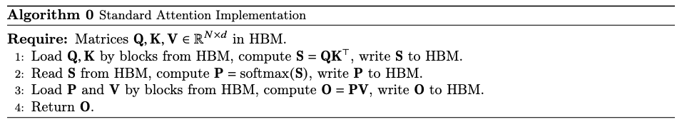
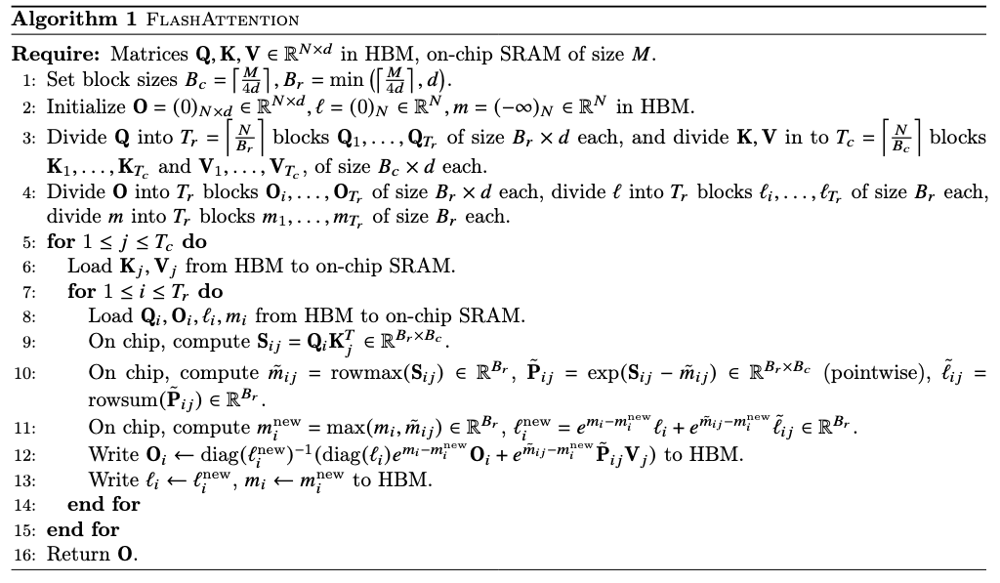

# FlashAttention 原理
## 简介和相关前置

FlashAttention 的核心目标是通过融合(fusing)注意力计算中的多个操作(如 Q, K, V 矩阵乘法、softmax 归一化、与 V 的加权求和等)，直接在硬件(如 GPU)的高速缓存（SRAM）中完成计算，从而最小化对慢速全局内存(如 HBM)的读写次数。这被称为“IO 感知”(IO-aware)。 具体而言，FlashAttention使用==平铺和重计算==等经典技术，将输入块从HBM加载到SRAM(快速缓存)，在SRAM上执行注意力操作，并将结果更新回HBM。FlashAttention减少了内存读写量，从而实现了2-4倍的时钟时间加速。

------
-  HBM(high bandwidth memory) 和 SRAM（static random-access memory）。速度上SRAM>HBM>DRAM
-  MAC(Memory Access Cost) 是指在计算机系统中，访问内存或存储器所需的时间和资源开销。它是衡量计算机程序或算法性能的重要指标之一。 MAC的值取决于多个因素，包括内存层次结构、缓存命中率、内存带宽、存储器延迟等。较低的MAC值表示访问内存的开销较小，而较高的MAC值表示访问内存的开销较大。

## 原理

### 传统Attention
对于输入序列 $Q,K,V\in R^{N\times d}$，$N$是序列长度，$d$是token尺寸，$N>>d$。

self-attention计算输出 $O \in R^{Nd}$ , 计算公式为：
$$
S=QK^T \in R^{N\times d}，P=softmax(S)\in R^{N\times N},O=PV\in R^{N\times d}
$$
传统attention计算流程为:<!-- 同级目录 -->


### FlashAttention
核心思想是传统减少HBM的访问，将$QKV$切分为小块后放入SRAM中
核心方法是tiling和recomputation
#### Tiling(平铺):分块计算
Softmax计算方法：
$$softmax(x_j)=\frac{e^{x_j}}{\sum_{i=1}^k{e^{x_i}}}$$
softmax操作是row-wise的，即每行都算一次softmax，所以需要用到平铺算法来分块计算softmax。
原始softmax数值不稳定，为了数值稳定性，FlashAttention采用safe softmax，向量 $\in R$ 的safe softmax 计算如下

$$m(x): = \max _{i} x_{i}, \quad f(x): = \left[\begin{array}{lll}
e^{x_{1}-m(x)} & \ldots & e^{x_{B}-m(x)}
\end{array}\right], \quad \ell(x): = \sum_{i} f(x)_{i} \\
\operatorname{softmax}(x): = \frac{f(x)}{\ell(x)}$$
同理，则$x=[x^{(1)}x^{(2)}] \in R^{2B}$ 的softmax也可以通过分解进行计算：
$$\begin{aligned}
m(x) & =m\left(\left[x^{(1)} x^{(2)}\right]\right)=\max \left(m\left(x^{(1)}\right), m\left(x^{(2)}\right)\right), \\
f(x) & =\left[e^{m\left(x^{(1)}\right)-m(x)} f\left(x^{(1)}\right) \quad e^{m\left(x^{(2)}\right)-m(x)} f\left(x^{(2)}\right)\right], \\
\ell(x) & =\ell\left(\left[x^{(1)} x^{(2)}\right]\right)=e^{m\left(x^{(1)}\right)-m(x)} \ell\left(x^{(1)}\right)+e^{m\left(x^{(2)}\right)-m(x)} \ell\left(x^{(2)}\right), \\
\operatorname{softmax}(x) & =\frac{f(x)}{\ell(x)}
\end{aligned}$$

$f(x)$和$l(x)$都可以通过分块计算得出，所以FlashAttention在计算时通过分块将$Q，K，V$分块后，按块加载到内存中。

#### 前向计算步骤
**伪代码：**



**Algorithm 1 returns $O=softmax(QK^T)V$ with $𝑂(N^2d)$ FLOPs and requires $O(b)$ additional memory beyond inputs and output.**

<details>
<summary>前向计算Python代码</summary>

```python
import torch
NEG_INF = -1e10  # -infinity
EPSILON = 1e-10
Q_LEN = 6
K_LEN = 6
Q_BLOCK_SIZE = 3
KV_BLOCK_SIZE = 3
P_DROP = 0.2
Tr = Q_LEN // Q_BLOCK_SIZE
Tc = K_LEN // KV_BLOCK_SIZE
Q = torch.randn(1, 1, Q_LEN, 4, requires_grad=True).to(device='cpu')
K = torch.randn(1, 1, K_LEN, 4, requires_grad=True).to(device='cpu')
V = torch.randn(1, 1, K_LEN, 4, requires_grad=True).to(device='cpu')
O = torch.zeros_like(Q, requires_grad=True)
l = torch.zeros(Q.shape[:-1])[..., None]
m = torch.ones(Q.shape[:-1])[..., None] * NEG_INF
//step 4
Q_BLOCKS = torch.split(Q, Q_BLOCK_SIZE, dim=2)
K_BLOCKS = torch.split(K, KV_BLOCK_SIZE, dim=2)
V_BLOCKS = torch.split(V, KV_BLOCK_SIZE, dim=2)
//step 5
O_BLOCKS = list(torch.split(O, Q_BLOCK_SIZE, dim=2))
l_BLOCKS = list(torch.split(l, Q_BLOCK_SIZE, dim=2))
m_BLOCKS = list(torch.split(m, Q_BLOCK_SIZE, dim=2))
//step 6
for j in range(Tc):
    //step 7
    Kj = K_BLOCKS[j]
    Vj = V_BLOCKS[j]
    //step 8
    for i in range(Tr):
        //step 9
        Qi = Q_BLOCKS[i]
        Oi = O_BLOCKS[i]
        li = l_BLOCKS[i]
        mi = m_BLOCKS[i]
        //step 10
        S_ij = torch.einsum('... i d, ... j d -> ... i j', Qi, Kj)
        //step 11
        mask = S_ij.ge(0.5)
        S_ij = torch.masked_fill(S_ij, mask, value=0)
        //step 12
        m_block_ij, _ = torch.max(S_ij, dim=-1, keepdims=True)
        P_ij = torch.exp(S_ij - m_block_ij)
        l_block_ij = torch.sum(P_ij, dim=-1, keepdims=True) + EPSILON
        P_ij_Vj = torch.einsum('... i j, ... j d -> ... i d', P_ij, Vj)
        //step 13
        mi_new = torch.maximum(m_block_ij, mi)
        li_new = torch.exp(mi - mi_new) * li + \
                torch.exp(m_block_ij - mi_new) * l_block_ij
        //step 14
        m = torch.nn.Dropout(p=P_DROP)
        P_ij_Vj = m(P_ij_Vj)
        // Step 15
        O_BLOCKS[i] = (li / li_new) * torch.exp(mi - mi_new) * Oi \
                    + (torch.exp(m_block_ij - mi_new) / li_new) * P_ij_Vj
        print(f'-----------Attention : Q{i}xK{j}---------')
        print(O_BLOCKS[i].shape)
        print(O_BLOCKS[0])
        print(O_BLOCKS[1])
        print('\n')
        // step 16
        l_BLOCKS[i] = li_new
        m_BLOCKS[i] = mi_new

O = torch.cat(O_BLOCKS, dim=2)
l = torch.cat(l_BLOCKS, dim=2)
m = torch.cat(m_BLOCKS, dim=2)