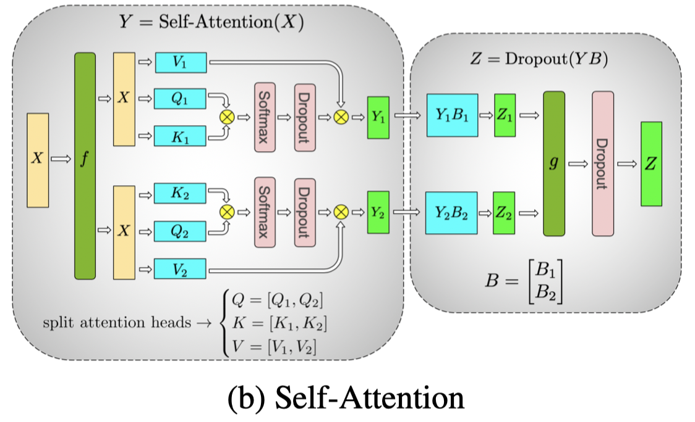
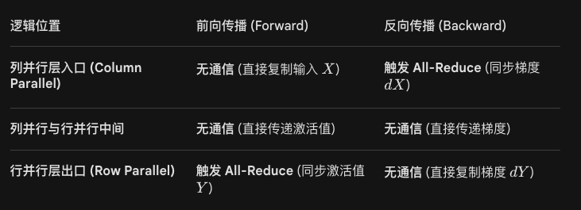
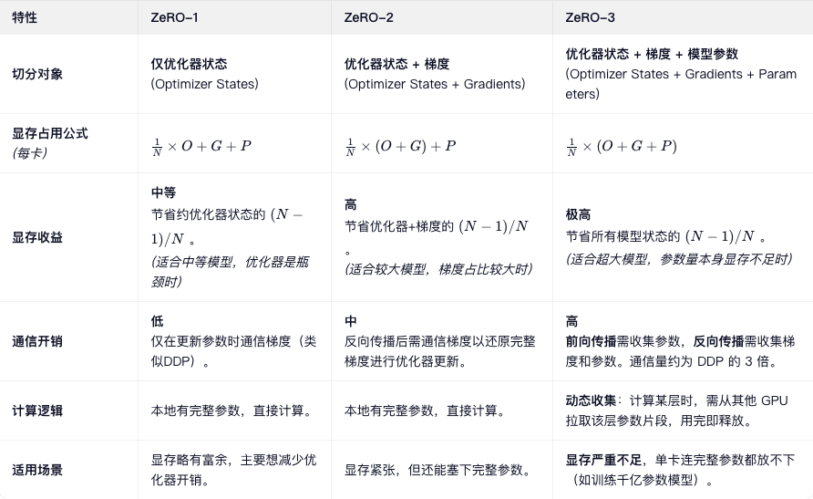
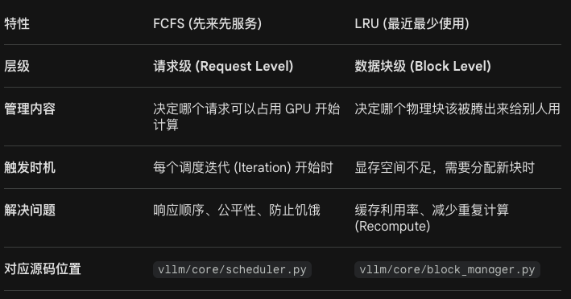

# 介绍Flash Attention的原理和实现思路
FlashAttention 是一项突破性的注意力机制计算优化技术。它在**不改变模型输出（精确计算）**的前提下，大幅降低了计算复杂度和显存占用，从而显著提升了大语言模型（LLM）的训练和推理速度。


## 1. 背景与痛点：为什么需要 FlashAttention？

在标准的 Transformer 模型中，自注意力（Self-Attention）的计算公式如下：

$$\text{Attention}(Q, K, V) = \text{softmax}\left(\frac{QK^T}{\sqrt{d}}\right)V$$

设序列长度为 $N$，特征维度为 $d$。标准 Attention 存在以下致命痛点：

* **时间和显存的二次复杂度**：计算 $QK^T$ 会生成一个 $N \times N$ 的注意力矩阵（Attention Matrix）。当序列长度 $N$ 增加时（如从 2K 扩展到 32K 或 128K），时间和显存占用会呈 $O(N^2)$ 爆炸式增长。
* **内存墙（Memory Wall）瓶颈**：现代 GPU 的计算速度（FLOPs）远快于其显存读写速度（Memory Bandwidth）。GPU 的存储分为容量大但速度慢的 **HBM（高带宽内存/主存）** 和容量极小但速度极快的 **SRAM（片上缓存）**。
* **标准 Attention 的读写浪费**：标准计算需要在 HBM 中来回读写庞大的 $N \times N$ 矩阵（计算 $QK^T$ 写入 HBM -> 读出做 softmax 写入 HBM -> 读出与 $V$ 相乘）。**大量的执行时间被浪费在了 HBM 的数据搬运上，而不是实际的数学计算上。**

## 2. FlashAttention 的核心原理

FlashAttention 的核心思想是 **IO-Aware（感知输入输出）**。它的目标是尽可能减少 HBM 的读写次数，让数据留在 SRAM 中把活干完。其主要依赖两大核心原理：**Tiling（分块计算）** 和 **Recomputation（重计算）**。

### 2.1 Tiling（分块计算）
与其一次性把庞大的 $Q, K, V$ 矩阵送入内存计算，不如把它们切分成小块（Blocks）。
* 将大矩阵分块加载到速度极快的 SRAM 中。
* 在 SRAM 中原地完成矩阵乘法和 Softmax 操作。
* 直接输出最终的结果矩阵到 HBM，而不需要在 HBM 中保存中间的 $N \times N$ 矩阵。

### 2.2 Recomputation（重计算）
在反向传播计算梯度时，标准方法需要保存正向传播时计算出的 $N \times N$ 注意力矩阵和 Softmax 结果，这极度消耗显存。
* FlashAttention 丢弃了这些庞大的中间矩阵（将显存复杂度从 $O(N^2)$ 降到了 $O(N)$）。
* 在反向传播时，它利用保留下来的少部分统计量（Softmax 的分母和局部最大值），在 SRAM 中**重新计算**一遍前向的注意力结果来求梯度。虽然增加了少量的计算量（FLOPs），但由于省去了大量的 HBM 读写时间，整体速度反而大幅提升。

## 3. 关键实现思路：Online Softmax

分块计算面临的最大数学难题是 **Softmax**。Softmax 需要知道整行的数据才能计算分母（总和）和防止数值溢出的最大值。如果分块计算，每次只能看到一部分数据，怎么算全局的 Softmax？

FlashAttention 巧妙地利用了 **Online Softmax（在线 Softmax 或 Safe Softmax）** 技巧，通过维护两个标量来局部更新结果。

### 局部更新推导
对于一个向量 $x$，标准的 Safe Softmax 为防止指数爆炸，会减去最大值 $m$：$m = \max(x)$，$f(x) = e^{x - m}$，$l = \sum f(x)$，$\text{softmax}(x) = \frac{f(x)}{l}$

假设我们将向量切分为两块：$x = [x_1, x_2]$。我们可以分别在局部更新这些值：
1.  **处理第一块 $x_1$**：
    * 计算局部最大值：$m_1 = \max(x_1)$
    * 计算局部指数和：$l_1 = \sum e^{x_1 - m_1}$
2.  **处理第二块 $x_2$**：
    * 计算当前局部最大值：$m_{2\text{local}} = \max(x_2)$
    * **更新全局最大值**：$m_2 = \max(m_1, m_{2\text{local}})$
    * **校正过去的指数和并加上新的**：$l_2 = l_1 \cdot e^{m_1 - m_2} + \sum e^{x_2 - m_2}$
3.  **计算最终输出**：利用更新后的统计量，结合局部的 $V$ 矩阵，增量式地累加并修正最终的输出向量。

### 算法外层循环逻辑
1.  在 HBM 中初始化输出矩阵 $O$。
2.  将 $K$ 和 $V$ 在序列维度上切分成大小为 $B_c$ 的块。
3.  将 $Q$ 和输出 $O$ 切分成大小为 $B_r$ 的块。
4.  **外循环**：遍历 $K$ 和 $V$ 的每一个块，将其加载到 SRAM。
5.  **内循环**：遍历 $Q$ 和 $O$ 的每一个块，将其加载到 SRAM。
    * 在 SRAM 中计算当前块的 $QK^T$。
    * 应用 Online Softmax 逻辑更新局部的最大值 $m$ 和指数和 $l$。
    * 计算当前块与 $V$ 的乘积，并利用新的统计量修正 $O$ 的历史累加值。
    * 将更新后的 $O$ 块写回 HBM。
# 三代FlashAttention的区别
**FA2** 相比于FA1核心改进是重新排列循环顺序。FA1 的顺序是：for head in heads: for block_q in Q: ...
FA2 的顺序是：for block_q in Q: for head in heads: ...
意义：这种改变使得在处理同一个 Q 块时，可以并行处理所有头（Heads），极大地增加了并行度，减少了启动内核的开销。其他优化：1.减少了线程间的同步开销。2.更好地利用了 Tensor Cores。3.支持更长的序列和更大的 Head Dimension（如 256）
**FA3**:背景：H100/H800 引入了许多新特性（如 FP8 Tensor Cores, 异步内存拷贝 TMA），FA2 未能完全利用这些特性，GPU 利用率仍有瓶颈（约 35-50%）
**FP8 支持：** 原生支持 FP8 (E4M3/E5M2) 精度。FP8 的吞吐量是 BF16/FP16 的 2 倍（在 H100 上）。通过量化感知或直接 FP8 计算，进一步加速。
**异步执行 (Asynchronous Execution)** 利用 Hopper 的 TMA (Tensor Memory Accelerator) 单元，实现数据拷贝（HBM <-> SRAM）与计算（Tensor Core）的完全重叠。
FA2 中，拷贝和计算仍有部分串行；FA3 做到了“一边搬运下一块数据，一边计算当前块”，消除了 IO 等待。
**Warp 级专业化:** 不同的 Warp（线程束）专门负责不同的任务（如有的专门负责加载，有的专门负责 softmax，有的负责 GEMM），减少指令冲突。
**因果掩码与滑动窗口优化:** 针对 Causal Mask 和 Sliding Window 进行了更深度的定制优化，减少无效计算。
# GPU matrix transpose使用shared memory的好处
在 CUDA 编程中，矩阵转置是一个非常经典的案例。直接在全局内存（Global Memory）上进行转置效率极低，而引入共享内存（Shared Memory）可以带来数倍的性能提升。这背后的核心原因在于**内存合并访问（Memory Coalescing）**。
## 1. 核心痛点：全局内存的非合并访问
要理解 Shared Memory 的好处，首先要看如果不使用它会发生什么（即最基础的 Naive 实现）。
矩阵转置的数学本质是 $A^T_{i, j} = A_{j, i}$。在 GPU 中，如果按常规方式为每个线程分配任务：
* **读操作（Read）**：线程沿着矩阵的“行”连续读取 Global Memory。由于相邻线程（属于同一个 Warp）读取的内存地址也是连续的，这满足**合并访问（Coalesced Access）**，读取效率极高。
* **写操作（Write）**：线程读取完数据后，需要将其写入目标转置矩阵的“列”。此时，相邻线程写入的内存地址在物理上是不连续的（跨度为矩阵的宽度）。这导致了**非合并访问（Uncoalesced Access）**。
**代价**：Global Memory 的非合并写入会触发大量的内存事务（Memory Transactions），极大地浪费了显存带宽，导致整体转置性能断崖式下跌。
## 2. Shared Memory 的解决思路：充当“缓存中转站”
Shared Memory 是位于 GPU 流式多处理器（SM）内部的片上内存，它的带宽远高于 Global Memory，且延迟极低。在矩阵转置中，我们可以利用它来巧妙地规避 Global Memory 的非合并写入问题。
**具体实现步骤（Tiling 分块策略）：**
1.  **合并读入 Shared Memory**：将大矩阵划分为一个个小的二维数据块（Tile，例如 32x32）。一个线程块（Thread Block）负责处理一个 Tile。线程按“行”从 Global Memory 中**合并读取**数据，并写入 Shared Memory 中对应的位置。
2.  **块内同步**：调用 `__syncthreads()`，确保该 Tile 的所有数据都已成功加载到 Shared Memory 中。
3.  **在 Shared Memory 中转置并合并写出**：这是最关键的一步。由于 Shared Memory 即使非连续访问，其延迟代价也远小于 Global Memory，线程可以按“列”从 Shared Memory 中读出数据，然后按“行”将其**合并写入**到 Global Memory 的目标位置。
**核心好处**：通过 Shared Memory 这个高速中转站，我们将原本低效的**“合并读 + 非合并写”**，成功转换成了高效的**“合并读 + 合并写”**。
## 3. 进阶收益：解决 Bank Conflict（存储体冲突）
仅仅引入 Shared Memory 实现了 Global Memory 的合并访问，这还不够完美。在上述步骤 3 中，线程按“列”读取 Shared Memory 时，由于 Shared Memory 是由多个 Bank（通常是 32 个）组成的，按列读取往往会导致多个线程同时访问同一个 Bank 中的不同地址，这被称为 **Bank Conflict**。这会使得内部内存访问串行化，降低局部效率。
**Shared Memory 的独有优势（Padding 技巧）**：
因为 Shared Memory 是我们自己管理的片上内存，我们可以通过修改其声明方式来轻松解决这个问题。只需在声明 Shared Memory 二维数组时，给列维度加上 1 的 Padding（填充）：

```cpp
// 假设 TILE_DIM 为 32
__shared__ float tile[TILE_DIM][TILE_DIM + 1];
```

- CPU按列遍历一个行优先的矩阵相比按行遍历为什么性能会变差，具体是因为哪个性能指标变差导致的-. weight-only量化有哪些，实现weight-only量化cuda kernel时如何优化访存，是否了解Marlin kernel
- Megatron SP的实现方式
- DeepSpeed ZeRO stage1和stage 2的通信量区别，论文和代码实现有没有gap
- 多GPU通信时NVSHMEM和NVLink的区别

# 数据并行 (Data Parallelism, DP & DDP)：
**DDP与DP的区别**

    - DP是单进程多线程的，只能在单机上工作；DDP是多进程的，可以在多级多卡上工作。DP通常比DDP慢，
    主要原因有：1）DP是单进程的，受到GIL（(Global Interpreter Lock)，同
    一时刻只能有一个线程执行 Python 字节码 ）的限制；2）DP每个step都需要拷贝模型，
    以及划分数据和收集输出；
    - DDP可以与模型并行相结合；
    - DP的通信成本随着卡数线性增长，DDP支持Ring-AllReduce，通信成本是固定的（T=2(N−1)×S/N/B）
    
    
**PyTorch 中 DDP（distributed data parallel） 的底层实现原理是什么？梯度同步发生在哪一步？如何实现计算与通信的重叠（Overlap）？**

    1. 底层原理可以总结为多进程并发 + 梯度分桶（Bucketing） + 环形全归约（Ring-AllReduce）。
    底层实现原理：分桶（Bucketing）。DDP 并不是在所有参数梯度计算完后才一次性同步，这样会导致 GPU 在等待通信时大量闲置。
        - 分桶机制：DDP 在初始化时，将模型的所有参数按照反向传播的逆序（从输出层到输入层）划分为多个桶（Buckets）。
        - 单位通信：每个桶的大小通常为 25MB。当一个桶内的所有参数都计算出梯度后，该桶就会立即触发通信操作。
    2. 梯度同步发生在 反向传播（Backward Pass） 过程中。
    具体来说，DDP 在模型初始化时为每个参数注册了 autograd hook（自动微分钩子）。
        当 loss.backward() 执行时，算子逐个计算梯度。一旦某个参数的梯度计算完成，对应的钩子函数被触发。钩子函数会将该梯度标记为“Ready”。
        当同一个桶里的所有梯度都达到 Ready 状态，DDP 就会启动 AllReduce 操作来同步这些梯度。
        注意： 梯度同步不是在 optimizer.step() 中发生的，optimizer.step() 只负责根据已经同步好的梯度更新参数。

    3. 如何实现计算与通信的重叠（Overlap）？
    这是 DDP 性能优于 DataParallel (DP) 的关键。其实现依赖于 多流（Multi-stream） 异步执行。
        异步通信流：PyTorch 会开辟一个专门用于通信的 CUDA Stream。
        并行执行：计算流（Default Stream）：继续向前计算模型中前面层的梯度（例如从第 n 层往第 1 层算）。通信流（Communication Stream）：同时在后台对已经计算好的第 n+1 层到第 n+m 层的梯度桶进行 AllReduce 同步。
        结果：理想情况下，通信时间被掩盖在计算时间之内，这种现象被称为 "Communication Hiding"（通信隐藏）
# 张量并行
熟练掌握 Megatron-LM 的 1D 张量并行。MLP 层和 Attention 层分别是如何切分的？前向传播（Forward）和反向传播（Backward）中分别在哪里需要发生 All-Reduce 通信？
**MLP 层的切分方式**

MLP 层通常由两个线性层组成：$Y=GeLU(XA)B$。
    第一个线性层 (Column Parallel): 权重矩阵 A 按列切分。
        每个 GPU 持有 A 的一部分 Ai​。
        计算过程：$Y1​=[XA_1​,XA_2​,...,XA_n​]$。
        结果： 每个 GPU 得到输出的一部分（列切分状态），无需通信即可直接进入 GeLU。
    第二个线性层 (Row Parallel): 权重矩阵 B 按行切分。
        每个 GPU 持有 B 的一部分 Bi​。
        计算过程：$Y=[XA_1​,XA_2​][B_1​B_2​​]=XA_1​B_1​+XA_2​B_2$​。
        结果： 这是一个部分和 (Partial Sum)。为了得到最终完整的 Y，必须进行一次 All-Reduce。
**Attention 层的切分方式**
Attention 的切分逻辑与 MLP 类似，利用了多头注意力（Multi-Head Attention）天然的可并行性。

    Query, Key, Value (Column Parallel):
        将众多的 Attention Heads 分配到不同的 GPU 上。例如，如果有 16 个头，2 个 GPU，则每个 GPU 负责 8 个头的计算。
        在计算完Softmax(QK^T)V后，每个 GPU 得到的是自己负责的那部分 Heads 的结果。
    Linear Projection (Row Parallel):
        紧接在 Attention 后的线性层按行切分。
        每个 GPU 将自己计算的 Heads 结果与对应的权重行相乘。
        结果： 同样产生部分和，需要一次 All-Reduce 汇总所有 Head 的信息。
{width=70%}
**通信发生的时机**
在 1D 张量并行中，通信的触发具有高度的对称性。
{width=70%}
**Megatron-LM 实现的 Transformer 模型为例，在一个标准的 Transformer Layer（一个Block） 中，通常需要进行 2 次 AllReduce 操作**：
$W_{QKV}$ 按列切分计算得到$W_{O}$，这个过程不需要通信，在各自GPU进行。
$W_{O}$按行切分进行计算，然后进行一次$AllReduce$ 然后给到MLP (Feed-Forward) 模块 (1 次 AllReduce)
MLP 通常包含两个线性层:$X\cdot W_1$和 $activation\cdot W_2$，第一层 $W_1$ 按列划分，第二层 $W_2$ 按行划分，这一层计算完成之后需要进行通信一次（(1 次 AllReduce)）。

# 流水线并行
**GPipe 与 1F1B 的区别** 

    这是两种不同的调度策略，主要区别在于内存压力和流水线效率。
    GPipe (Synchronous Pipeline)采用的是“全进全出”策略：
        流程：先连续进行 M 个 Micro-batches 的前向传播（Forward），全部完成后，再连续进行 M 个微批次的反向传播（Backward）。
        缺点：内存峰值极高。因为第一个 Micro-batch 的前向激活值必须保留到最后，直到对应的反向传播完成。这导致内存占用随 Micro-batch 的数量线性增加。

    1F1B (One Forward One Backward)是 Megatron-LM 采用的改进策略，旨在解决内存问题：
        流程：在流水线进入“稳定期”后，每个节点每执行完一个前向任务，就立即执行一个反向任务。
        优点：显著降低内存占用。一个 Micro-batch 的反向一旦完成，其占用的激活值内存即可立即释放，内存峰值只与流水线深度 p 有关，而与 Micro-batch 数量 m 无关。

**流水线气泡（Bubble）的计算与减少**
**如何计算气泡时间？**

    假设有P个阶段，总共有m个micro-batches，前方计算时间为Tf，后向计算时间为Tb。流水线气泡时间表示为：
    T=(P-1)*(Tf+Tb),气泡占总计算时间的比例（假设 tf​≈tb​）约为：Bubble Fraction=(p−1)/m
**如何减少气泡？**

    增加 Micro-batch 数量 (m)：让 m>>p。当微批次足够多时，首尾的填装/清空时间（气泡）相对于中间的稳定运行时间会变得非常小。
    交错式流水线 (Interleaved Pipeline)：这是 Megatron-LM 提出的高级技巧。每个 GPU 不再只负责连续的一段层（如 GPU 0 负责 1-4 层），而是交叉负责（如 GPU 0 负责 1-2 层和 9-10 层）。这样可以进一步减小气泡时间，但会增加通信频率。​
**切分不均匀（Load Imbalance）会导致什么问题？**

    理想情况下，每个 GPU 负责的计算量应该是均等的。如果切分不均匀（例如 GPU 0 负责 10 层，而 GPU 1 只负责 2 层）：
    木桶效应 (Bottleneck)：整个流水线的步调受限于计算最慢（层数最多）的那个 GPU。
    气泡急剧扩大：计算快的 GPU 会长时间处于等待状态。在上文公式中，计算时间 tf​ 和 tb​ 将由最慢的 Stage 决定，导致实际利用率远低于理论值。
    内存不均：负责层数多的 GPU 激活值缓存压力更大，容易导致该节点显存溢出（OOM），而其他 GPU 显存大量闲置。

# 序列并行
1. Megatron-LM SP：打破冗余的算子并行

Megatron 的 SP 是对 张量并行（TP） 的一种延伸，主要针对 Transformer 层中原本无法被 TP 切分的算子（如 LayerNorm 和 Dropout）。

    核心原理：
        在 TP 中，LayerNorm 和 Dropout 是在所有 TP GPU 上冗余计算的（每张卡都存一份完整的序列激活值）。
        Megatron SP 将序列维度 L 在 TP 组内进行切分。
        通信机制：利用 Reduce-Scatter 取代原来的 All-Reduce（在前向传播中），在反向传播中使用 All-Gather。
    解决了什么瓶颈？
        激活值冗余：它消除了 LayerNorm 和 Dropout 产生的冗余激活值，显著降低了显存占用。
        计算与通信效率：它并没有引入额外的通信开销，而是将 TP 原有的 All-Reduce 拆分成了两步（Reduce-Scatter + All-Gather），通信量保持不变，但显存更省。
2. DeepSpeed-Ulysses：全注意力的分布式方案

Ulysses 是为了解决 超长序列 计算而设计的。它的核心是将序列维度切分到不同的 GPU 上，但在计算 Attention 时通过通信“换回”全量信息。

    核心原理：
        切分：在进入 Attention 计算前，数据按序列维度 L 切分在各卡上。
        通信 (All-to-All)：在计算 Attention 之前，执行一次 All-to-All 通信。这会将“按序列切分”的数据转换为“按注意力头（Head）切分”的数据。
        计算：每张卡在本地计算完整的序列长度，但只负责一部分注意力头。
        通信 (All-to-All)：计算完 Attention 后，再次执行 All-to-All，将数据转回“按序列切分”的状态，以便进行后续的 MLP 计算。
    解决了什么瓶颈？
        O(L^2) 复杂度限制：通过这种方式，Attention 的计算被均匀分布到了所有卡上。
        通信带宽限制：All-to-All 的通信量与 GPU 数量无关，且在现代网络（如 NVLink）中效率极高。它打破了传统 TP 在 Head 数量较少时无法扩展到更多 GPU 的限制。
# 四者的区别和适用
小模型用 DP，大模型单机用 TP，超大模型跨机用 PP，MoE 模型用 EP，实际生产中通常是 TP+PP+DP 混合打满集群。

# ZeRO 显存优化 (Zero Redundancy Optimizer)： 
- ZeRO-1、ZeRO-2、ZeRO-3 分别切分了什么（优化器状态、梯度、模型参数）？它们各自带来的显存收益和通信开销代价是多少？
**优化器状态=主权重副本+一阶动量+二阶动量**


# 精度相关
- 什么是混合精度，除了混合精度还有什么减少显存占用的方法
FP16 (半精度)（1 位符号 + 5 位指数 + 10 位尾数）范围为$[6\cdot 10^{-8},65504]$ / BF16 (Brain Floating Point)(1 位符号 + 8 位指数 + 7 位尾数)$[1\cdot 10^{-38},3.4 \cdot 10^{38}]$：占 2 字节。用于前向传播、反向传播的大部分矩阵运算。优势：显存占用减半，Tensor Core 计算速度提升 2-8 倍（取决于 GPU 架构）。劣势：数值范围小，容易下溢 (Underflow) 变成 0，或上溢 (Overflow) 变成 NaN。
FP32 (单精度)（1 位符号 + 5 位指数 + 10 位尾数）：占 4 字节。用于维护主权重副本 (Master Weights) 和优化器状态。作用：保证参数更新的精度和稳定性，防止微小梯度丢失。
**工作流程 (Loss Scaling 是关键)**
为了解决 FP16 梯度太小变成 0 的问题，引入了 Loss Scaling 技术：
前向传播：用 FP16 计算，得到 Loss (FP16)。
放大 Loss：将**Loss 乘以一个系数 S** (如 512 或 动态调整)，防止梯度下溢。
反向传播：基于放大后的 Loss 计算梯度 (FP16)。此时梯度值变大，保留了有效信息。转换与更新：将 FP16 梯度除以 S，还原为真实梯度。转换为 FP32,在 FP32 的主权重副本 上进行优化器步骤 (Adam 更新)。将更新后的 FP32 权重复制回 FP16 模型，供下一轮前向传播使用。
- 其余节约显存的方法：1.梯度累积 2. 激活重计算/梯度检查点 3.ZeRO（零冗余优化器）4.低秩适应与PEFT 5.模型量化 6.算子融合和内存优化分配器
- PEFT (参数高效微调)PEFT 的核心思想：冻结预训练模型的大部分参数（通常 >99%）。仅训练极少数的新增参数或特定层参数（通常 <1%）。
效果：在达到与全量微调相近性能的同时，将显存需求降低到原来的 1/10 甚至更低，且每个任务的适配器（Adapter）只有几 MB 到几百 MB，方便存储和切换。
常见的 PEFT 方法包括：Adapter Tuning：在 Transformer 层中插入小型神经网络模块。
Prompt Tuning / P-Tuning：只优化输入端的软提示（Soft Prompts）向量。
LoRA (Low-Rank Adaptation)：目前的主流王者 -- 知乎文档https://www.zhihu.com/tardis/zm/art/623543497?source_id=1003
# Ray
- Ray 是一个开源的通用分布式计算框架，由加州大学伯克利分校的 RISELab 于 2017 年提出。它的核心目标是让开发者能够像编写单机 Python 代码一样，轻松地将应用扩展到大型集群上，特别专注于人工智能（AI）、机器学习（ML）和强化学习（RL）等新兴负载
**特点:** 1.极简的分布式编程 2.Ray 从底层架构就是为低延迟、高并发、细粒度任务设计的，非常适合 AI 负载(毫秒级任务调度.原生支持复杂依赖图.零拷贝共享内存 (Plasma Store)) 3.强大的 AI 生态系统 (Ray Ecosystem) Ray 不仅仅是一个调度器，它围绕 AI 生命周期构建了一整套高级库（Ray Libraries），覆盖了从数据处理到模型服务的全流程 4.弹性伸缩与云原生集成
# KvCache 原理
- 在 Transformer 模型的自回归（Auto-regressive）生成过程中，如果每次生成一个新的 Token，都把之前所有的历史 Token 重新进行一次完整的前向传播（Forward Pass），计算量会随着序列长度 N 呈 $O(N^2)$ 增长。
这是因为 Self-Attention 机制中，Query 需要和之前所有的 Key 做点积。对于已经计算过的历史部分，其 Key (K) 和 Value (V) 矩阵是固定不变的，重复计算不仅浪费算力，还会导致生成延迟（Latency）极高，无法满足实时性要求
- **缓存内容** 在生成第 t 个 Token 时，我们将前 t−1 个 Token 经过 Attention 层计算得到的 Key 矩阵 和 Value 矩阵 保存到显存中，这就是 KV Cache。
- **复用机制** 当生成第 t+1 个 Token 时：1.前向传播：只对新输入的 Token 进行计算，得到当前的 q,k,v （注意这里是向量或小矩阵）2. 拼接 (Concat)：将新的 k,v 拼接到之前缓存的​ $K_{cache}和 V_{cache}$ 后面，形成完整的 $K_{all}$ 和 $V_{all}$ 3.Attention 计算：用新的q和 $V_{all}$ 和$K_{all}$做计算。4.更新缓存:将新生成的 k,v 写入显存，更新 KV Cache，供下一步使用

# TRiton

**RoPE 的 Triton 实现中，如何利用 tl.arange 处理旋转位置编码的三角函数计算优化？**

**核心优化思路**
RoPE 的公式需要对查询向量 q 和键向量 k 的每一对相邻元素 
$(2i,2i+1)$ 应用旋转矩阵：
$ \begin{pmatrix} q_{2i} \\ q_{2i+1} \end{pmatrix} \leftarrow A = \begin{pmatrix} cos{(m\theta_i)} & -sin{(m\theta_i)} \\ sin{(m\theta_i)} & cos{(m\theta_i)} \end{pmatrix} \begin{pmatrix} q_{2i} \\ q_{2i+1} \end{pmatrix}$,其中$ \theta_i =10000^{-2i/d}$
传统低效做法：
在每个线程内循环计算 $sin$ 和 $cos$，或者多次调用标量数学函数。
Triton 优化做法 (tl.arange)：
1. 预计算频率索引：使用 tl.arange 生成 $[0,\frac{d}{2}]$ 的序列。
2. 向量化计算 $θ$ ：利用广播机制，一次性算出所有维度的 
3. 位置依赖计算：结合当前 token 的位置 $m$ (由 program_id 推导)，一次性算出$cos(mθ)$ 和 $sin(mθ)$ 向量。
4. 成对处理：利用 tl.arange 的步长特性或直接索引操作，同时加载偶数和奇数位置的数据进行旋转。
2. 代码实现详解
下面是一个高效的 RoPE Triton Kernel 实现示例，重点展示了 tl.arange 的用法：

``` Python
import triton
import triton.language as tl
import torch

@triton.jit
def rope_kernel(
    Q_ptr, K_ptr,           # 输入指针
    OutQ_ptr, OutK_ptr,     # 输出指针
    seq_len, head_dim,      # 序列长度，头维度
    stride_qz, stride_qh, stride_qt, stride_qd, # Q 的步长
    stride_kz, stride_kh, stride_kt, stride_kd, # K 的步长
    stride_oz, stride_oh, stride_ot, stride_od, # 输出的步长
    INV_FREQ_PTR,           # 预计算的 1/(10000^(2i/d)) 指针，形状 [head_dim/2]
    BLOCK_D: tl.constexpr,  # head_dim 必须整除 BLOCK_D
):
    # 1. 获取当前程序块处理的维度：(batch, head, seq_pos)
    pid_z = tl.program_id(0)
    pid_h = tl.program_id(1)
    pid_t = tl.program_id(2)  # 当前 token 的位置 m
    
    # 2. 使用 tl.arange 生成当前块内的维度偏移量 [0, BLOCK_D)
    # 假设我们一个 block 处理整个 head_dim (BLOCK_D == head_dim)
    # 如果 head_dim 很大，可以分块处理，这里简化为一次处理完
    d_offs = tl.arange(0, BLOCK_D)
    
    # 3. 构造全局索引
    # Q 的指针偏移: [batch, head, seq_pos, :]
    q_ptrs = Q_ptr + pid_z * stride_qz + pid_h * stride_qh + pid_t * stride_qt + d_offs * stride_qd
    k_ptrs = K_ptr + pid_z * stride_kz + pid_h * stride_kh + pid_t * stride_kt + d_offs * stride_kd
    
    # 4. 加载数据
    # 注意：实际使用中需要 mask 防止越界，这里假设 seq_len 和 head_dim 对齐
    q = tl.load(q_ptrs).to(tl.float32)
    k = tl.load(k_ptrs).to(tl.float32)
    
    # 5. 【核心优化】利用 tl.arange 计算旋转角度
    # 我们需要的是 freqs = 10000^(-2i/d)，通常预先计算好存在 INV_FREQ_PTR 中
    # 加载预计算的频率: 形状 [BLOCK_D/2]，我们需要将其扩展或重复以匹配 BLOCK_D
    # 技巧：只加载前一半，然后利用 reshape 或 repeat 逻辑
    
    half_d = BLOCK_D // 2
    d_half_offs = tl.arange(0, half_d)
    
    # 加载预计算的逆频率 (inv_freq[i] = 1 / 10000^(2i/d))
    inv_freq = tl.load(INV_FREQ_PTR + d_half_offs).to(tl.float32)
    
    # 计算当前 token 位置 pid_t 的角度: theta = pid_t * inv_freq
    # 形状: [half_d]
    freqs = pid_t * inv_freq 
    
    # 计算 sin 和 cos
    cos_vals = tl.cos(freqs)
    sin_vals = tl.sin(freqs)
    
    # 6. 构造完整的旋转因子向量 ( interleaving )
    # RoPE 作用于 (2i, 2i+1)。
    # 我们需要将 [cos0, cos1, ...] 变成 [cos0, cos0, cos1, cos1, ...] 
    # 或者更巧妙地，直接分别处理偶数和奇数索引
    
    # 方法 A: 使用 tl.interleave (如果版本支持) 或手动索引
    # 这里演示手动索引重构，兼容性更好
    
    # 创建偶数索引 [0, 2, 4, ...] 和 奇数索引 [1, 3, 5, ...]
    # 利用 tl.arange 生成基础索引，然后变换
    even_offs = 2 * d_half_offs       # [0, 2, 4, ...]
    odd_offs  = 2 * d_half_offs + 1   # [1, 3, 5, ...]
    
    # 提取 q 和 k 的偶数和奇数部分
    q_even = tl.load(q_ptrs + (even_offs - d_offs) * stride_qd) # 需要调整指针逻辑，这里简化示意
    # 更简单的做法：直接利用切片逻辑重组 cos/sin
    
    # 【推荐做法】直接重组 cos/sin 向量以匹配 q/k 的形状
    # cos_full = [cos0, cos0, cos1, cos1, ...]  <-- 错误，RoPE 公式是：
    # q[2i]   = q[2i]*cos - q[2i+1]*sin
    # q[2i+1] = q[2i]*sin + q[2i+1]*cos
    
    # 所以我们需要：
    # cos_vec = [cos0, cos1, cos2, ...] 重复两次? 不，是交错。
    # 让我们直接用公式计算：
    
    # 取出偶数位和奇数位的数据 (假设 BLOCK_D 较小，可以直接 gather)
    # 为了性能，通常我们加载整个 q，然后用 tl.reshape 或索引操作
    # 这里使用一种常见的 Triton 模式：
    
    # 将 q 分为两半看待不太直观，直接按公式：
    # q_even = q[0::2], q_odd = q[1::2]
    # 由于 tl.load 是一次性加载，我们可以用 tl.reshape 把 [D] 变成 [D/2, 2]
    
    q_2d = tl.reshape(q, (half_d, 2)) # 形状 [half_d, 2], 第1维是 i, 第2维是 (even, odd)
    k_2d = tl.reshape(k, (half_d, 2))
    
    q_even = q_2d[:, 0]
    q_odd  = q_2d[:, 1]
    k_even = k_2d[:, 0]
    k_odd  = k_2d[:, 1]
    
    # 应用旋转公式
    # new_even = old_even * cos - old_odd * sin
    # new_odd  = old_even * sin + old_odd * cos
    
    out_q_even = q_even * cos_vals - q_odd * sin_vals
    out_q_odd  = q_even * sin_vals + q_odd * cos_vals
    
    out_k_even = k_even * cos_vals - k_odd * sin_vals
    out_k_odd  = k_even * sin_vals + k_odd * cos_vals
    
    # 7. 合并结果
    # 将 [half_d] 和 [half_d] 重新交错合并回 [D]
    # 构造输出张量
    out_q_2d = tl.stack([out_q_even, out_q_odd], axis=1) # [half_d, 2]
    out_k_2d = tl.stack([out_k_even, out_k_odd], axis=1)
    
    out_q = tl.reshape(out_q_2d, (BLOCK_D,))
    out_k = tl.reshape(out_k_2d, (BLOCK_D,))
    
    # 8. 存回
    out_q_ptrs = OutQ_ptr + pid_z * stride_oz + pid_h * stride_oh + pid_t * stride_ot + d_offs * stride_od
    out_k_ptrs = OutK_ptr + pid_z * stride_oz + pid_h * stride_oh + pid_t * stride_ot + d_offs * stride_od # 注意 K 的步长可能不同，需修正
    
    tl.store(out_q_ptrs, out_q)
    tl.store(out_k_ptrs, out_k)
```

**RMSNorm的TRiton实现**
    <details>
    <summary>RMSNorm_triton</summary>
``` Pythonimport torch
import triton
import triton.language as tl
@triton.jit
def quadratic_mean(
    input_ptr,output_ptr,
    N,BLOCK_SIZE:tl.constexpr
):
    pid=tl.program_id(0)
    offset=pid*BLOCK_SIZE+tl.arange(0,BLOCK_SIZE)
    input=tl.load(input_ptr+offset,mask=offset<N,other=0.0)
    output=tl.sum(input*input)/N
    tl.atomic_add(output_ptr,output)
@triton.jit
def rms_kernel(input_ptr,output_ptr, quadratic_mean_ptr,gamma,beta,N,eps,BLOCK_SIZE:tl.constexpr):
    pid=tl.program_id(0)
    offset=pid*BLOCK_SIZE+tl.arange(0,BLOCK_SIZE)
    input=tl.load(input_ptr+offset,mask=offset<N,other=0.0)
    rms=tl.sqrt(tl.load(quadratic_mean_ptr)+eps)
    output=input*gamma/rms+beta
    tl.store(output_ptr+offset,output,mask=offset<N)

# input, output are tensors on the GPU
def solve(input: torch.Tensor, gamma: float, beta: float, output: torch.Tensor, N: int, eps: float):
    BLOCK_SIZE=256
    quadratic=torch.zeros( (1),dtype=input.dtype,device=input.device)
    grid=(triton.cdiv(N,BLOCK_SIZE),)
    quadratic_mean[grid](
        input,quadratic,N,BLOCK_SIZE
    )
    rms_kernel[grid](
        input,output,quadratic,gamma,beta,N,eps,BLOCK_SIZE
    )
```
</details>

# 显存管理与性能调优

- **训练一个模型需要占用哪些显存？（权重、梯度、优化器状态如 Adam 的一阶和二阶动量、激活值/Activations、KV Cache）。如果是混合精度训练（FP16/BF16 + FP32），具体占用怎么算？**

1. 显存的占用主要可以分为静态显存和动态显存，假设模型参数量为 $\phi$, 
A. 模型状态 -- 静态占用 1.权重 2.梯度 3.优化器状态
B. 剩余部分 -- 动态占用 1.激活值-大小随着Batch_size和序列长度线性增加 2.临时缓冲区 3.显存碎片
模型权重（精度为FP16/BF16，字节参数为2B，**占用显存 $2\phi$**
梯度（精度为FP16/BF16，字节参数为2B，**占用显存 $2\phi$**
主权重副本（精度为FP32，字节参数为4B，**占用显存 $4\phi$**
优化器状态-动量（一阶动量）（精度为FP32，字节参数为4B，**占用显存 $4\phi$**
优化器状态-方差（二阶动量）（精度为FP32，字节参数为4B，**占用显存 $4\phi$**，总共占用 **$16\phi$**，训练8B的模型，占用显存 **112GB**

2. **激活值的计算**（最容易OOM的部分，对于Transformer结构，一层的激活值占用近似公式为: 
$$Memory\approx BatchSize×SeqLen×HiddenSize×(34+\frac{5×NumHeads×SeqLen​}{HiddenSize}​)$$
这部分可以通过flashattention优化
3. 训练阶段：通常不使用 KV Cache。因为训练时我们已知完整的序列，可以直接并行计算全量 Attention 矩阵。

3. 推理阶段：采用 Autoregressive (自回归) 生成。为了避免重复计算已经生成的 Token，会将每一层的 K 和 V 向量存在显存中，即 KV Cache。
占用计算：$2×Layers×Heads×HeadDim×SeqLen×BytesPerParam$.
# 手撕代码
手撕刷题网站:https://www.deep-ml.com/problems
手撕MHA、GQA、MQA、sparse MOE top-k routing、softmax、flashattention(先后顺序从大到小)

# 针对简历的问题


- **你的 LRU 换出具体是针对 GPU 显存到 CPU 内存（Swap） 的过程，还是针对 Prefix Caching 的淘汰？还有MLFQ用在哪。如果是 Swap，你是如何处理在换回（Swap-in）时的同步延迟问题的？**

    用 MLFQ 决定请求的算力优先级，用 LRU 决定 KV Cache 块的生存优先级。

- **Prefill和decode的区别**
prefill和decode的区别，哪个更容易造成显存瓶颈：
首先，Prefill（预填充）和Decode（解码）是大模型推理的两个核心阶段，它们的计算特征截然不同：
Prefill 阶段是处理用户输入的完整 Prompt。它是一个计算密集型（Compute-Bound）的过程，利用 GPU 的高并行度一次性计算出所有输入 Token 的 KV Cache。它的瓶颈主要在于GPU 算力，直接决定了首字延迟（TTFT）。
Decode 阶段则是自回归地逐个生成 Token。它是一个典型的显存带宽密集型（Memory-Bound）过程。每生成一个 Token，都需要从显存中读取全部历史的 KV Cache，而计算量极小。这导致 GPU 大部分时间在等待数据搬运，其瓶颈在于显存带宽，直接决定了吐字速度（TPOT）。
关于哪个更容易造成显存瓶颈，这取决于我们定义的是“容量”还是“带宽”，但通常Decode 阶段是更关键的制约因素：
从显存容量（Capacity）：Decode 阶段是导致显存溢出（OOM）。因为 KV Cache 随着生成的序列长度线性增长，且需要长期驻留显存。在高并发场景下，多个长序列的累积会迅速耗尽显存，限制了系统的最大并发数（Batch Size）。这也是为什么像 vLLM 的 PageAttention 技术如此重要，它正是为了解决 Decode 阶段的显存碎片化问题，以容纳更多并发请求。
从显存带宽（Bandwidth）：Decode 阶段是绝对的性能瓶颈。由于算术强度极低，生成速度完全受限于显存读取速度。随着上下文窗口变大，读取开销剧增，导致生成变慢。
- **多级反馈队列（MLFQ）通常用于操作系统处理长短进程。在 LLM 推理场景下，首字延迟（TTFT）和每字输出延迟（TPOT）的权衡是关键。你的调度器是如何定义‘优先级’的？是基于 Prompt 长度，还是基于已经生成的 Token 数量？这种调度在处理Batching（连续批处理）时，如何避免因为频繁切换请求而导致的计算效率下降？**

    不是直接按 Prompt 长度排优先级。nanovllm/engine/scheduler.py:84 的 prefill 阶段按 waiting 队列顺序取请求，主要受 max_num_batched_tokens 和 can_allocate 约束。也不是直接按“已生成 token 总数”排序。decode 阶段的优先级由 MLFQ level 决定，level 变化由“本层已服务步数”控制：nanovllm/engine/scheduler.py:113 到 nanovllm/engine/scheduler.py:117。每次被调度一次 decode，decode_steps_in_level += 1，达到 quantum 就降级。quantum 在 nanovllm/engine/scheduler.py:30，默认是 1,2,4...（见 nanovllm/config.py:19）。有 aging 机制防饥饿。nanovllm/engine/scheduler.py:53 到 nanovllm/engine/scheduler.py:67：等太久会被提升回更高优先级队列。所以优先级实质是“**最近服务历史 + 等待时长**”，而不是 token 长度的静态属性。
    **对 TTFT / TPOT 的影响：**
    TTFT 倾向优先。只要有可接纳的 waiting 请求，schedule() 会先走 prefill 并立即返回。这会让新请求更快拿到首字。
    TPOT 通过 MLFQ 做折中。长生成请求会逐步降级，避免一直占据高优先级；短/新请求更容易插入，交互体验更好。但代价是老请求单请求 TPOT 可能上升。

    **Batching 下如何避免频繁切换导致效率下降**   
    “切换”是逻辑调度，不是进程级上下文切换。每个 step 仍是一次 batched forward：LLMEngine.step() 里把 seqs 一起送进 ModelRunner.run()。因此不会出现 OS 那种高昂 context switch 成本。
    decode 批处理仍尽量做大。在每个 level 中持续 popleft 直到 max_num_seqs，见 nanovllm/engine/scheduler.py:106。这保持了 continuous batching 的规模。内核启动开销被 CUDA Graph 缓解。decode 小步长下，run_model() 使用预捕获 graph（nanovllm/engine/model_runner.py:191 到 nanovllm/engine/model_runner.py:203），减少动态 batch 带来的 launch 开销。目前的一个现实限制。prefill 与 decode 是“二选一”调度周期（有 prefill 就不做 decode），见 nanovllm/engine/scheduler.py:98。这对 TTFT 友好，但在 prefill 压力大时会拉高 decode TPOT。如果要进一步优化，通常会做 chunked prefill 或 prefill/decode 混排，而不是完全互斥。
## vllm相关
-- **vLLM中用到了FCFS+priority 和LRU，这两者有何不同**：
{width=50%}
- **vLLM中的Prefix Cache 的淘汰逻辑？：**
    为了理解它是如何淘汰的，我们需要先看 vLLM 是如何管理这些“块（Blocks）”的。
    1. 核心管理机制：Block Manager
    vLLM 的内存管理类 BlockManager 会将物理显存划分为许多固定大小的 Physical Blocks。对于开启了 Prefix Caching 的系统，物理块被分为两种状态：
        活跃块 (Active/Used Blocks)：当前正在被某个或多个序列（Sequence）引用的块。
        缓存块 (Cached Blocks)：当前没有被任何运行中的序列引用，但其内容（KV Cache）被保留在内存中，以备未来相同的 Prompt 前缀再次命中。
    2. 具体的淘汰流程
    当系统需要为新请求分配空间，但空闲内存（Free Pool）耗尽时，淘汰逻辑会按以下步骤触发：
    第一步：检查引用计数
    每个物理块都有一个 ref_count（引用计数）。
        如果一个块正在被某个请求使用，ref_count > 0，绝对不会被淘汰。
        只有当一个请求结束（Finished）或被抢占（Preempted）时，它所占用的块的 ref_count 才会减少。
    第二步：进入 LRU 队列
    当一个块的 ref_count 变为 0 时，它不会被立即清空，而是会被移动到 BlockManager 维护的一个 LRU 缓存队列中。
        这个队列记录了哪些前缀块是最近被访问过的。
        只要内存足够，这些 ref_count = 0 的块就会一直待在显存里，实现“热启动”。
    第三步：执行 LRU 淘汰
    当新请求到达且空闲列表为空时，BlockManager 会从 LRU 队列的头部（即最久未使用的块） 开始回收：
        查找：定位到 LRU 队列中最早进入的物理块。
        释放：将其从哈希表（Hash Map，用于匹配前缀）中移除。
        回收：将该物理块标记为空闲，重新放入空闲块池（Free Pool）供新请求使用。
    3. 特殊情况：层级依赖关系
    Prefix Caching 是树状结构的（类似文件系统的目录）。
        如果一个长前缀被淘汰，它所依赖的基础前缀（更短的前缀）不一定会被淘汰。
        但是，淘汰通常是从叶子节点开始的。因为长前缀包含的信息更具体，重用概率相对较低；而短前缀（如 System Prompt）被多个请求共享，其引用计数归零的机会更少，因此更难被 LRU 踢出。
    4. 总结：淘汰逻辑的三个层级
        引用计数保护：只要有人在用，就不删（这是为了保证物理上的正确性）。
        LRU 排序：没人用了，按最后一次使用时间排序（这是为了性能最优化）。
        按需回收：只有内存真的不够用了，才按 LRU 顺序强制回收（这是为了利用率最大化）。
    监控：调度器实时监控 BlockManager 中的空闲块数量。
    触发：当新请求到达，所需 Block 数 > 当前空闲 Block 数时，触发淘汰。
    筛选：遍历所有 cached blocks。
    排除 ref_count > 0 (正在被活跃请求使用) 的块。根据策略（默认通常是 LRU）排序候选块。
    执行：释放选中的物理 Block，将其加入空闲列表。从哈希索引中移除对应的 (prefix_hash, block_id) 映射。分配：将释放出的 Block 分配给新请求。
- **vllm是不是prefill优先？**
不是，当 Prompt 非常长时，Prefill 阶段可能会占用 GPU 很长时间，导致正在进行的 Decode 请求被迫等待（增加 TTFT 和 TPOT 延迟）。
机制：vLLM 引入了 Chunked Prefill。它将一个长 Prompt 的 Prefill 任务拆分成多个小的 Chunk（例如每次处理 512 或 1024 个 Token）。
调度逻辑：1. 调度器执行一个 Chunk 的 Prefill 计算。2. 暂停该请求，将 GPU 资源让给其他处于 Decode 阶段的请求执行一步。3.下一轮调度再回来执行该请求的下一个 Chunk。
优势：降低延迟抖动：避免了长 Prefill 独占 GPU 导致的 Decode 请求长时间停顿。
平滑流量：使得 Prefill 和 Decode 可以更细粒度地交错执行，保持 GPU 流水线的连续性。
- **prompt如何查找prefix cache**
第一步：分块（Token Blocking）
系统将 Prompt 按照固定步长（如每 16 个 Token 一组）切分成若干个逻辑块。
第二步：逐块哈希匹配
    第一个块：计算第一个块的哈希值（通常包含 System Prompt），在哈希表中查找。
    命中（Hit）：如果找到，获取对应的物理块 ID，并将其关联到当前请求的逻辑映射表中。
    递归向下：基于第一个块的 ID，计算第二个块的复合哈希值（Hash(Block_1 + Block_2)），继续查找。
    未命中（Miss）：一旦某个块在哈希表中找不到，查找停止。
第三步：计算剩余部分（Prefill）
    从第一个未命中的块开始，到 Prompt 结束的所有 Token，都需要经过 GPU 的 Prefill（预填充） 计算来生成新的 KV Cache。
    新生成的 KV Cache 会被存入新分配的物理块，并同时注册到哈希表中，供未来的请求“乘凉”。
 - **vllm是如何调度的?** :
**请求到达:** 请求进入等待队列，调度器分析其 Prompt 长度和所需显存块数量。
**前缀匹配:** 检查 Radix Tree，看是否有可复用的 KV Cache 块（Prefix Caching），减少计算量。
**资源分配 (PagedAttention):** 查看显存空闲块池。如果有足够块：分配物理块，更新块表，将请求加入运行队列 (Running Queue)。
如果块不足：触发抢占 (Preemption)，将运行队列中优先级低或耗时长的请求 Swap 到 CPU 内存，腾出空间给新请求。
**迭代执行 (Continuous Batching):** 在每一步 (Step)，GPU 并行执行运行队列中所有请求的一个 Token 生成。
**动态调整:** 请求完成后立即释放块；新请求若有资源立即插入；长 Prefill 任务被分块执行以避免阻塞。
**输出:** 生成的 Token 流式返回给用户。
 - **vllm的Continuous Batching（持续批处理）和静态批处理?** :
 如果 Batch Size 设为 4，系统会等待 4 个请求。即使其中 3 个请求已经生成完毕（遇到了 [EOS] 停止符），它们也必须留在显存里，直到最长的那条序列也跑完。
 
    Continuous Batching（持续批处理）：
    推理不再是以“整趟任务”为单位，而是以“单个 Token 的生成”为单位。 随到随上：每完成一个 Token 的计算周期，系统就会检查：有没有新请求进来？有没有请求刚写完 [EOS]？即完即走：一旦某个请求生成结束，它的 Slot 会立刻被释放，新的请求可以在下一个 Token 计算周期直接补位，而不需要等待其他请求结束。让 Prefill 和 Decode 请求在同一个 Batch 中混合执行。GPU 不会因为等待某个长请求而空转，始终处于高负载状态。
# PD分离
**什么是pd分离**:
PD分离是一种针对大模型推理特性的架构优化策略，它将计算密集且高并行的Prefill（预填充）阶段与访存密集且串行的Decode（解码）阶段解耦，部署在不同的资源池或硬件节点上；这种设计不仅消除了两阶段因资源需求不匹配（算力vs显存带宽）导致的相互阻塞和‘木桶效应’，还能通过独立的弹性伸缩和异构硬件搭配（如用高性价比卡做P、大显存卡做D），在显著降低推理成本的同时，最大化系统吞吐量并优化首字延迟。

# Pageattention 简单实现
``` Python

```
# Deepseek模型结构
## DPSK V1

## DPSK V2

## DPSK V3
# GRPC通信