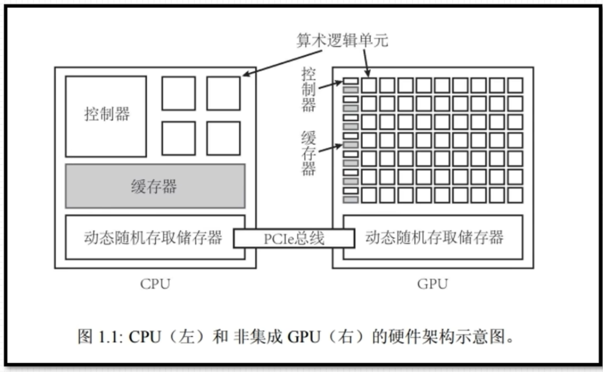
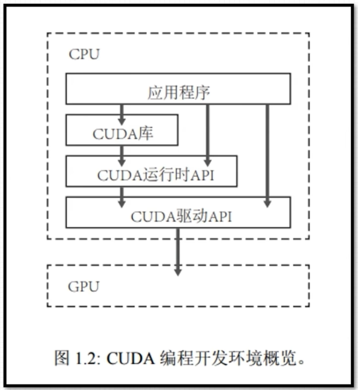

# cuda编程入门
## 什么是GPU
### GPU性能指标：
1.核心数 2.GPU显存容量 3.GPU计算峰值 4.显存带宽：运算单元和显存之间的通信速率，显存带宽越大代表交换速度越快
### CPU+GPU异构架构：
GPU不能单独计算，CPU+GPU组成异构计算架构。CPU起到控制作用，一般称为主机（Host）。GPU可以看作是CPU的协作处理器，一般称为设备（Device）
{width=50%}
主机和设备之间的内存访问一般通过PCIe总线链接
## CUDA简介：
CUDA最初基于C语言，后面越来越多支持C++，CUDA还支持Python开发
{width=40%}
- CUDA提供两层API接口，分别是CUDA驱动（driver）API（类似程序开发语言）和CUDA运行（runtime）时API（类似汇编语言）。两种API性能几乎无差异。
```cuda
#include<stdio.h>
__global__ void hello_from_gpu(){
    printf("Hello world from the GPU\n")
}
int main(void){
    hello_from_gpu<<<4,4>>>();
    cudaDeviceSynchronize();
    return 0;
}
```
## nvidia-smi工具和参数：
nvidia-smi -q 查询GPU详细信息
nvidia-smi -q -i 0查询特定GPU的详细信息
nvidia-smi -q -i 0 -d MEMORY显示GPU特定信息
nvidia-smi -h 执行帮助命令 ECC 是否开启错误检查和纠错技术，0关闭，1开启
Compute M 计算模式 Memory-Usage 显存使用率 Volatile GPU-UTil:GPU使用率

## CUDA编程以及GPU线程模型：
### C++中的Hello World
- 文本编辑器编写源代码，如vscode，可以使用任何文本编辑器，如vim等
- 编译器对源码进行预处理、编译、链接等操作生成可执行文件，c++中使用G++
- 运行可执行文件
### CUDA中的Hello World
**nvcc:** 编译CUDA文件的指令：nvcc hello.cu -o hello
- 安装CUDA即可使用nvcc
- nvcc支持纯c++代码的编译
- 编译扩展名为.cu的CUDA文件
## CUDA核函数：
### 核函数：
- 核函数在GPU上进行并行执行
- 1.限定词——global_修饰 2.返回值必须是void
- 形式：两种形式的CUDA函数都正确
    ```C++
    （1）__global__ void kernel_function(argument arg)
    {
        printf("Hello World from the GPU!\n");
    }
    （2）void __global__  kernel_function(argument arg)
    {
        printf("Hello World from the GPU!\n");
    }
    ```
- 注意事项：==1.核函数只能访问GPU内存 2.核函数不能使用变长参数（支持函数接收不定数量参数的参数） 3，核函数不能使用静态变量（一次初始化，全程保留值） 4.核函数不能使用函数指针 5.核函数具有异步性==
### CUDA程序编写流程：
```C++
int main(void){
    主机代码
    核函数调用
    主机代码
    return 0；
}
```
**注意：核函数不支持c++的iostream**
```C++
#include<stdio.h>
__global__ void hello_from_gpu()
{
    printf("Hello world from the GPU");
}
int main(void){
    hello_from_gpu<<<1,1>>>();//两个1分别代码线程块的数量和线程块中线程的数量
    cudaDeviceSynchronize();//同步函数等待GPU执行完毕
    return 0；
}
```
