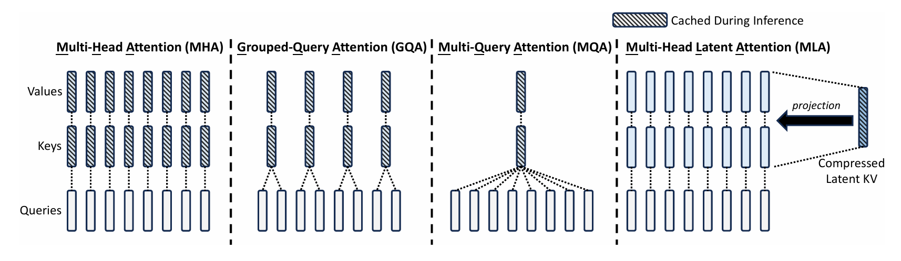
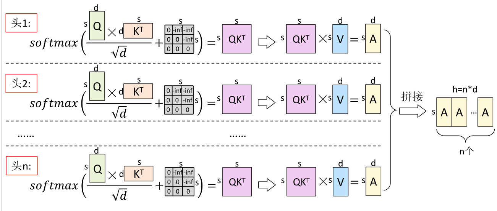
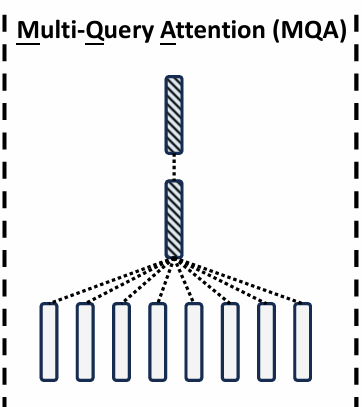
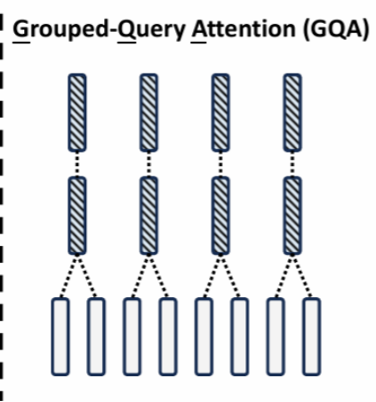

# Picotron
参考课程:https://www.bilibili.com/video/BV1vGRpYvE4R/?spm_id_from=333.1387.favlist.content.click&vd_source=4bb508727c639cc0fda63b8fa83cc370
(又是被印度人统治的一天)
## 激活重计算

## 数据并行
数据并行分为DP（Data Parallel）、DDP （Distributed Data Parallel）和 FSDP（Fully Sharded Data Parallel）

- DP:一个老板（主进程）管多个员工（GPU），所有员工的工作内容、参数都一样，老板统一分发任务、收集结果、更新参数
- DDP:多机多卡 / 单机多卡场景下，每个 GPU 对应一个独立进程，每个进程都持有完整的模型参数。通过 NCCL 通信库实现梯度的高效同步（Ring AllReduce 算法），每个进程独立更新参数（因为梯度同步后参数一致）
- 基于 DDP 改进，解决大模型显存不足问题。将模型参数、梯度、优化器状态都 “分片”（Shard）到不同的 GPU / 节点上，每个 GPU 只持有模型的一部分数据，训练时按需加载 / 卸载分片，通过通信同步分片数据。关键特性：支持 “ZeRO 优化”（零冗余优化器），分为 ZeRO-1（分片优化器状态）、ZeRO-2（分片梯度 + 优化器状态）、ZeRO-3（分片参数 + 梯度 + 优化器状态），FSDP 默认接近 ZeRO-3
## Pytorch DDP 中dp naive 和 dp bucketing的区别
### Data Parallel Naive（朴素数据并行）
**特点**
- 每个 GPU 完成整个反向传播（Backward Pass）后，逐个参数发起梯度同步
- 即：对每个参数张量 $grad_i$，单独执行一次 All-Reduce

PyTorch 自动求导引擎能够接纳自定义反向钩子。DDP 通过注册自动求导钩子，在每次反向传播结束后触发计算流程。钩子触发时，会全面扫描所有本地模型参数，从各个参数里获取梯度张量。随后，对每个参数运用 AllReduce 集体通信（对所有进程的该参数的梯度进行求和或者取平均），计算所有进程中每个参数的平均梯度，并将结果回写到梯度张量之中。朴素解决方案虽可行但存在以下不足：

- 对于大型模型中大量的小参数，AllReduce 操作在传输这些小梯度张量时效率较低。通信启动和同步的开销相对于小张量的实际数据量占比过大，导致传输过程浪费了大量时间。小张量通信效率低下会累积延迟，成为分布式训练的性能瓶颈。
- 梯度计算和梯度同步被分为两个独立阶段，二者串行进行。梯度计算完成后才启动通信，而通信完成后才继续下一步计算。这种串行设计导致计算设备在通信期间处于空闲状态，无法充分利用资源，降低了训练效率。
``` Python
import torch
import torch.nn as nn
import torch.optim as optim
from torch.utils.data import DataLoader, TensorDataset
from torch.nn.parallel import DistributedDataParallel as DDP
import torch.distributed as dist
import argparse
import os

def setup():
    """初始化分布式环境"""
    dist.init_process_group(backend="nccl")  # GPU 推荐 nccl
    torch.cuda.set_device(int(os.environ["LOCAL_RANK"]))

def cleanup():
    dist.destroy_process_group()

class SimpleModel(nn.Module):
    def __init__(self):
        super().__init__()
        self.net = nn.Sequential(
            nn.Linear(100, 512),
            nn.ReLU(),
            nn.Linear(512, 10)
        )
    
    def forward(self, x):
        return self.net(x)

def main():
    setup()
    local_rank = int(os.environ["LOCAL_RANK"])
    world_size = int(os.environ["WORLD_SIZE"])
    
    # 创建模型、优化器
    model = SimpleModel().to(local_rank)
    model = DDP(model, device_ids=[local_rank])
    
    # 模拟数据集
    dataset = TensorDataset(torch.randn(1000, 100), torch.randint(0, 10, (1000,)))
    sampler = torch.utils.data.distributed.DistributedSampler(
        dataset, num_replicas=world_size, rank=local_rank
    )
    dataloader = DataLoader(dataset, batch_size=32, sampler=sampler)
    
    criterion = nn.CrossEntropyLoss()
    optimizer = optim.SGD(model.parameters(), lr=0.01)
    
    # 训练循环
    model.train()
    for epoch in range(3):
        sampler.set_epoch(epoch)  # 确保每个 epoch 数据打乱不同
        for x, y in dataloader:
            x, y = x.to(local_rank), y.to(local_rank)
            optimizer.zero_grad()
            output = model(x)
            loss = criterion(output, y)
            loss.backward()
            optimizer.step()
        
        if local_rank == 0:  # 只让 rank 0 打印
            print(f"Epoch {epoch}, Loss: {loss.item():.4f}")
    
    cleanup()

if __name__ == "__main__":
    main()
```
### DP with Bucketing（分桶优化的 DP）
**特点**
- 将多个小梯度张量合并成一个“桶”（Bucket）（如 25MB）
- 反向传播过程中，一旦桶满，立即异步启动 All-Reduce
- 实现 “边计算边通信”（计算-通信重叠）

# nano-vllm
参考视频:https://www.bilibili.com/video/BV1sY3wzZEDJ?spm_id_from=333.788.videopod.sections&vd_source=4bb508727c639cc0fda63b8fa83cc370
讲解源码部分
## Prefill/Decode/KV Cache 
- **KV Cache**:
没有KV Cache时如何计算Transformer:
    <details>
    <summary>Python代码</summary>

    Step1
    ```Python
    # 输入序列
    X₁ = [P₁, P₂, P₃]  # 3个token
    # 计算 QKV（3个token都要算）
    Q₁ = X₁ @ Wq  # [3, d]
    K₁ = X₁ @ Wk  # [3, d]  ← 计算了P₁,P₂,P₃的K
    V₁ = X₁ @ Wv  # [3, d]  ← 计算了P₁,P₂,P₃的V
    # Attention
    attn = softmax(Q₁ @ K₁.T / √d)  # [3, 3]
    output = attn @ V₁
    # 取最后一个token作为输出
    O₁ = output[-1]
    ```
    Step2:
    ```Python
    # 输入序列（变长了）
    X₂ = [P₁, P₂, P₃, O₁]  # 4个token
    # 计算 QKV（4个token都要算，包括重复的P!）
    Q₂ = X₂ @ Wq  # [4, d]
    K₂ = X₂ @ Wk  # [4, d]  ← 又计算了P₁,P₂,P₃的K！浪费！
    V₂ = X₂ @ Wv  # [4, d]  ← 又计算了P₁,P₂,P₃的V！浪费！
    # Attention
    attn = softmax(Q₂ @ K₂.T / √d)  # [4, 4]
    output = attn @ V₂
    O₂ = output[-1]
    ```
    </details>

    有KV Cache时如何计算Transformer:
    <details>
    <summary>Python代码</summary>

    Prefill 阶段（构建缓存）
    ```Python
    import math
        # 输入: [P₁, P₂, P₃, ..., Pₙ]  n个prompt token
        # 对每一层 Transformer:
        for layer in layers:
            # 并行计算所有token的QKV
            Q = X @ Wq  # [n, d]
            K = X @ Wk  # [n, d]  ← 缓存
            V = X @ Wv  # [n, d]  ← 缓存
            # 存储到KV Cache
            kv_cache[layer] = {
                'K': K,  # [n, d]
                'V': V   # [n, d]
            }
            # 计算Attention输出
            output = softmax(Q @ K.T / math.sqrt(d)) @ V
    ```
     Decode 阶段（复用缓存）
    ```Python
    import math
        # 生成第1个token O₁:
    new_token = O₁
    for layer in layers:
        # 只计算新token的QKV
        q = new_token @ Wq  # [1, d]
        k = new_token @ Wk  # [1, d]
        v = new_token @ Wv  # [1, d]
        
        # 追加到缓存
        kv_cache[layer]['K'] = concat(kv_cache[layer]['K'], k)  # [n+1, d]
        kv_cache[layer]['V'] = concat(kv_cache[layer]['V'], v)  # [n+1, d]
        
        # Attention: Q只查询，KV用缓存
        output = softmax(q @ K_cache.T / math.sqrt(d)) @ V_cache
    ```
- 为什么Q不需要缓存:
    Q是当前token的查询向量。K是所有token的键向量。V是所有token的值向量。Q用完即弃，历史Q不会再被使用，缓存没有意义。

- 总推理时间 = Prefill 时间 + Decode 时间 × 生成 token 数
- 短 Prompt + 长回复：Decode 主导耗时
- 长 Prompt + 短回复：Prefill 主导耗时
┌─────────────────────────────────────────┐
│           Prefill 阶段                   │
│  输入: ["请", "解释", "Transformer"]     │
│        ↓ 并行计算                        │
│  输出: KV Cache + 第一个生成 token       │
└─────────────────────────────────────────┘
┌─────────────────────────────────────────┐
│           Decode 阶段                    │
│  输入: token₁ → token₂ → token₃ → ...   │
│        ↓ 串行迭代                        │
│  输出: 完整回复内容                      │
└─────────────────────────────────────────┘
## Self-attention - MHA GQA MQA MLA
{width=70%}
**Multi-HeadAttention（MHA）**
在推理过程中，随着输入文本的不断增多，由于KV cache越存越大的问题，所以出现了MQA
{width=70%}

**手撕代码** 推荐自己写一遍 网站 https://www.deep-ml.com/problems
```Python
import numpy as np
from typing import Tuple

def compute_qkv(X: np.ndarray, W_q: np.ndarray, W_k: np.ndarray, W_v: np.ndarray) -> Tuple[np.ndarray, np.ndarray, np.ndarray]:
    """
    Compute Query, Key, and Value matrices.
    
    Args:
        X: Input matrix of shape (seq_len, d_model)
        W_q, W_k, W_v: Weight matrices of shape (d_model, d_model)
    
    Returns:
        Q, K, V matrices each of shape (seq_len, d_model)
    """
    # Your code here
    Q=X @ W_q
    K=X @ W_k
    V=X @ W_v
    return Q,K,V

def self_attention(Q: np.ndarray, K: np.ndarray, V: np.ndarray) -> np.ndarray:
    """
    Compute scaled dot-product self-attention.
    
    Args:
        Q: Query matrix of shape (seq_len, d_k)
        K: Key matrix of shape (seq_len, d_k)
        V: Value matrix of shape (seq_len, d_k)
    
    Returns:
        Attention output of shape (seq_len, d_k)
    """
    # Your code here
    d=Q.shape[-1]
    atten_weights=Q@ K.T/np.sqrt(d)
    score=np.exp(atten_weights-np.max(atten_weights,axis=-1,keepdims=True))
    sco=score/np.sum(score,axis=-1,keepdims=True)
    out=sco@ V
    return out

def multi_head_attention(Q: np.ndarray, K: np.ndarray, V: np.ndarray, n_heads: int) -> np.ndarray:
    """
    Compute multi-head attention.
    
    Args:
        Q, K, V: Matrices of shape (seq_len, d_model)
        n_heads: Number of attention heads
    
    Returns:
        Attention output of shape (seq_len, d_model)
    """
    # Your code here
    seq_len,d_model=Q.shape
    d_k=d_model//n_heads
    Q_heads=Q.reshape(seq_len,n_heads,d_k).transpose(1,0,2)
    K_heads=K.reshape(seq_len,n_heads,d_k).transpose(1,0,2)
    V_heads=V.reshape(seq_len,n_heads,d_k).transpose(1,0,2)
    head_output=[]
    for i in range(n_heads):
        head_out=self_attention(Q_heads[i],K_heads[i],V_heads[i])
        head_output.append(head_out)
    out=np.concatenate(head_output,axis=-1)
    return out
```
**Multi-QueryAttention（MQA）**
MQA中每个head的Query共享K和V矩阵，KV cache的内存降低到了$\frac{1}{n}$, 缺点是会导致性能的下降以及模型的不稳定性。
{width=20%}

**手撕代码:**
``` Python
import numpy as np

def multiquery_attention(X: np.ndarray, W_queries: list, W_key: np.ndarray, W_value: np.ndarray, W_out: np.ndarray) -> np.ndarray:
    """
    Compute Multi-Query Attention.
    
    Args:
        X: Input array of shape (seq_len, d_model)
        W_queries: List of query weight matrices, each (d_model, d_k), one per head
        W_key: Shared key weight matrix of shape (d_model, d_k)
        W_value: Shared value weight matrix of shape (d_model, d_v)
        W_out: Output projection matrix of shape (num_heads * d_v, d_model)
    
    Returns:
        Output array of shape (seq_len, d_model), rounded to 4 decimal places
    """
    num_heads=len(W_queries)
    d_k=W_key.shape[-1]
    K=X@ W_key
    V=X@ W_value
    head_outputs=[]
    for h in range(num_heads):
        Q_h=X @ W_queries[h]
        s=Q_h @ K.T/np.sqrt(d_k)
        exp_s=np.exp(s-np.max(s,axis=-1,keepdims=True))
        atten_weights=exp_s/np.sum(exp_s,axis=-1,keepdims=True)
        head_out=atten_weights @ V
        head_outputs.append(head_out)
    out=np.concatenate(head_outputs,axis=-1)
    output=out @ W_out
    return np.round(output,4)
```

**Grouped-QueryAttention（GQA）**
{width=20%}
``` Python
def grouped_query_attention(Q, K, V, num_heads, num_kv_heads):
    """
    Compute Grouped Query Attention.
    
    Args:
        Q: Query tensor, shape (batch_size, seq_len, num_heads * head_dim)
        K: Key tensor, shape (batch_size, seq_len, num_kv_heads * head_dim)
        V: Value tensor, shape (batch_size, seq_len, num_kv_heads * head_dim)
        num_heads: Number of query heads
        num_kv_heads: Number of key/value heads
    
    Returns:
        Output tensor, shape (batch_size, seq_len, num_heads * head_dim)
    """
    def softmax(x,axis=-1):
        e_x=np.exp(x-np.max(x,axis=axis,keepdims=True))
        return e_x/np.sum(e_x,axis=axis,keepdims=True)
    batch_size,seq_len,q_dim=Q.shape
    head_dim=q_dim//num_heads
    num_groups=num_heads//num_kv_heads
    Q=Q.reshape(batch_size,seq_len,num_heads,head_dim).transpose(0,2,1,3)
    K=K.reshape(batch_size,seq_len,num_kv_heads,head_dim).transpose(0,2,1,3)
    V=V.reshape(batch_size,seq_len,num_kv_heads,head_dim).transpose(0,2,1,3)
    K=np.repeat(K,num_groups,axis=1)
    V=np.repeat(V,num_groups,axis=1)
    out=np.matmul(Q,K.transpose(0,1,3,2))/np.sqrt(head_dim)
    atten_weights=softmax(out,axis=-1)
    output=np.matmul(atten_weights,V)
    output=output.transpose(0,2,1,3).reshape(batch_size,seq_len,num_heads*head_dim)
    return output
```
## Rotary-Embedding

## 图捕获
**图捕获流程（CUDA Graph）**
捕获阶段 (Capture)：
- 程序先“ dummy run”（空跑）一次真实的计算过程。
- NVIDIA 驱动会记录这期间所有 GPU 操作（Kernel 启动、内存拷贝等）及其依赖关系，构建一个静态的 CUDA Graph。

重放阶段 (Replay/Instantiate)：
- 后续相同的计算请求，CPU 不再逐个发送 Kernel 启动指令。
- CPU 只需提交一个 “执行图” 的指令。
- GPU 驱动直接调度整个图，自动处理内部依赖，无需 CPU 频繁干预

## Moe的pytorch代码
- Expert Network (专家网络)：通常是前馈神经网络 (FFN)。
- Gating Network / Router (门控/路由网络)：决定哪些专家被激活以及权重是多少。
- Top-K Routing (Top-K 路由)：只选择得分最高的 K 个专家。
- Load Balancing Loss (负载均衡损失)：防止某些专家“累死”而其他专家“闲置”，确保训练稳定
## Tansformer的pytorch代码
ss
## PagedAttention
PagedAttention 是一种针对Tranformer模型中KVCache管理的优化技术，旨在解决长序列推理时KVCache的内存碎片化和高内存占用问题。通过引入分页机制，将KV Cache分块存储和管理，从而提高内存利用率、支持更长的序列长度，并提升推理服务的吞吐量和稳定性。
### PagedAttention分页机制
PagedAttention引入了以下关键概念:
1. 页面(Page):KV Cache被分割成固定大小的块，每个块存储一定数量的token的K和V
2. 页面大小:每个页面能容纳的token数量，通常是固定的
3. 块表(block table):每个序列维护一个块表，记录其KV Cache使用的页面编号(物理块索引)
4. 所有页面存储在一个全局内存池里，页面可以动态分配和释放，供不同序列复用
### 工作流程
假设一个 Transformer 模型有 $L$ 层，$H$ 个注意力头，头维度为 $d$，序列长度为 $T$，PagedAttention 的工作流程如下:
1. 初始化
- 创建一个全局页面池，包含多个固定大小的页面，每个页面存储 $N$ 个 token 的 $K$ 和 $V$.
- 为每个序列分配一个块表，初始为空
2. 生成新token
- 当生成新 token 时，计算其 $Q$、$K$、$V$。
- 检查当前序列的最后一个页面是否已满：
    - 如果未满，将新 token 的 $K$ 和 $V$ 写入当前页面。
    - 如果已满，从内存池分配一个新页面，更新块表，将 $K$ 和 $V$ 写入新页面
- 执行注意力计算
3. 页面管理
- 当序列生成结束，释放其占用的页面，归还到内存池。内存池支持动态分配，页面可以被其他序列复用。
4. 存储结构
- 页面 page_shape = (batch_size, num_heads, N, head_dim) 每个页面存储$N$个Token的$K$和$V$.
batch 维度通常在物理存储时被压缩为 1（因为一个物理块同一时间只服务一个序列的逻辑块），即逻辑上是 (B,H,N,D) ，但物理存储往往是(H,N,D) 或 (2,H,N,D) （2代表K和V）。
- 内存池 形状为 [num_pages,batch,heads,block_size,head_dim]
5. 内存访问优化
- 非连续内存访问:通过块表，PagedAttention 可以从非连续的页面中拼接出完整的 $K$ 和 $V$。
- CUDA 内核优化：在 GPU 上，PagedAttention 使用定制的 CUDA 内核，将页面拼接和注意力计算融合，减少内存拷贝开销
### 实现伪代码
``` Python
class PagedAttention:
    def __init__(self, num_layers, num_heads, head_dim, page_size, max_pages):
        self.page_size = page_size  # 每个页面存储的 token 数量
        self.memory_pool = torch.zeros((max_pages, num_layers, num_heads, page_size, head_dim))  # 页面池
        self.block_tables = {}  # 序列ID到页面编号的映射
        self.free_pages = list(range(max_pages))  # 可用页面列表

    def allocate_page(self, seq_id):
        """为序列分配新页面"""
        if not self.free_pages:
            raise RuntimeError("No free pages available")
        page_idx = self.free_pages.pop(0)
        if seq_id not in self.block_tables:
            self.block_tables[seq_id] = []
        self.block_tables[seq_id].append(page_idx)
        return page_idx

    def update_cache(self, seq_id, layer, K, V):
        """更新 KV Cache"""
        if seq_id not in self.block_tables or not self.block_tables[seq_id]:
            page_idx = self.allocate_page(seq_id)
        else:
            page_idx = self.block_tables[seq_id][-1]
            # 检查当前页面是否已满
            page_offset = len(self.block_tables[seq_id]) * self.page_size
            if page_offset >= self.page_size:
                page_idx = self.allocate_page(seq_id)

        # 写入 K 和 V 到页面
        self.memory_pool[page_idx, layer, :, page_offset % self.page_size, :] = K
        self.memory_pool[page_idx, layer, :, page_offset % self.page_size, :] = V

    def get_cache(self, seq_id, layer):
        """获取序列的 K 和 V"""
        if seq_id not in self.block_tables:
            return None, None
        pages = self.block_tables[seq_id]
        K_pages = [self.memory_pool[p, layer, :, :, :] for p in pages]
        V_pages = [self.memory_pool[p, layer, :, :, :] for p in pages]
        K = torch.cat(K_pages, dim=2)  # 拼接页面
        V = torch.cat(V_pages, dim=2)
        return K, V

    def attention(self, Q, K, V, seq_id, layer):
        """执行注意力计算"""
        self.update_cache(seq_id, layer, K, V)
        K_cached, V_cached = self.get_cache(seq_id, layer)
        scores = torch.matmul(Q, K_cached.transpose(-1, -2)) / sqrt(Q.size(-1))
        weights = torch.softmax(scores, dim=-1)
        output = torch.matmul(weights, V_cached)
        return output
```
# vLLM  
参考了https://www.cnblogs.com/zackstang/p/19036108
## Cuda算子
### RoPE 
<details>
<summary>RoPE_cuda</summary>

``` C
#include <torch/all.h>
#include <ATen/cuda/CUDAContext.h>
#include <c10/cuda/CUDAGuard.h>

#include "cuda_compat.h"
#include "dispatch_utils.h"

namespace vllm {

template <typename scalar_t, bool IS_NEOX>
inline __device__ void apply_token_rotary_embedding(
    scalar_t* __restrict__ arr, const scalar_t* __restrict__ cos_ptr,
    const scalar_t* __restrict__ sin_ptr, int rot_offset, int embed_dim) {
  int x_index, y_index;
  scalar_t cos, sin;
  if (IS_NEOX) {
    // GPT-NeoX style rotary embedding.
    x_index = rot_offset;
    y_index = embed_dim + rot_offset;
    cos = VLLM_LDG(cos_ptr + x_index);
    sin = VLLM_LDG(sin_ptr + x_index);
  } else {
    // GPT-J style rotary embedding.
    x_index = 2 * rot_offset;
    y_index = 2 * rot_offset + 1;
    cos = VLLM_LDG(cos_ptr + x_index / 2);
    sin = VLLM_LDG(sin_ptr + x_index / 2);
  }

  const scalar_t x = arr[x_index];
  const scalar_t y = arr[y_index];
  arr[x_index] = x * cos - y * sin;
  arr[y_index] = y * cos + x * sin;
}

template <typename scalar_t, bool IS_NEOX>
inline __device__ void apply_rotary_embedding(
    scalar_t* __restrict__ query,  // [batch_size, seq_len, num_heads,
                                   // head_size] or [num_tokens, num_heads,
                                   // head_size]
    scalar_t* __restrict__ key,    // nullptr or
                                   // [batch_size, seq_len, num_kv_heads,
                                   // head_size] or [num_tokens, num_kv_heads,
                                   // head_size]
    const scalar_t* cache_ptr, const int head_size, const int num_heads,
    const int num_kv_heads, const int rot_dim, const int token_idx,
    const int64_t query_stride, const int64_t key_stride,
    const int64_t head_stride) {
  const int embed_dim = rot_dim / 2;
  const scalar_t* cos_ptr = cache_ptr;
  const scalar_t* sin_ptr = cache_ptr + embed_dim;

  const int nq = num_heads * embed_dim;
  for (int i = threadIdx.x; i < nq; i += blockDim.x) {
    const int head_idx = i / embed_dim;
    const int64_t token_head =
        token_idx * query_stride + head_idx * head_stride;
    const int rot_offset = i % embed_dim;
    apply_token_rotary_embedding<scalar_t, IS_NEOX>(
        query + token_head, cos_ptr, sin_ptr, rot_offset, embed_dim);
  }

  if (key != nullptr) {
    const int nk = num_kv_heads * embed_dim;
    for (int i = threadIdx.x; i < nk; i += blockDim.x) {
      const int head_idx = i / embed_dim;
      const int64_t token_head =
          token_idx * key_stride + head_idx * head_stride;
      const int rot_offset = i % embed_dim;
      apply_token_rotary_embedding<scalar_t, IS_NEOX>(
          key + token_head, cos_ptr, sin_ptr, rot_offset, embed_dim);
    }
  }
}

template <typename scalar_t, bool IS_NEOX>
__global__ void rotary_embedding_kernel(
    const int64_t* __restrict__ positions,  // [batch_size, seq_len] or
                                            // [num_tokens]
    scalar_t* __restrict__ query,           // [batch_size, seq_len, num_heads,
                                   // head_size] or [num_tokens, num_heads,
                                   // head_size]
    scalar_t* __restrict__ key,  // nullptr or
                                 // [batch_size, seq_len, num_kv_heads,
                                 // head_size] or [num_tokens, num_kv_heads,
                                 // head_size]
    const scalar_t* __restrict__ cos_sin_cache,  // [max_position, 2, rot_dim //
                                                 // 2]
    const int rot_dim, const int64_t query_stride, const int64_t key_stride,
    const int64_t head_stride, const int num_heads, const int num_kv_heads,
    const int head_size) {
  // Each thread block is responsible for one token.
  const int token_idx = blockIdx.x;
  int64_t pos = positions[token_idx];
  const scalar_t* cache_ptr = cos_sin_cache + pos * rot_dim;

  apply_rotary_embedding<scalar_t, IS_NEOX>(
      query, key, cache_ptr, head_size, num_heads, num_kv_heads, rot_dim,
      token_idx, query_stride, key_stride, head_stride);
}

}  // namespace vllm

void rotary_embedding(
    torch::Tensor& positions,  // [batch_size, seq_len] or [num_tokens]
    torch::Tensor& query,  // [batch_size, seq_len, num_heads * head_size] or
                           // [num_tokens, num_heads * head_size] or
                           // [batch_size, seq_len, num_heads, head_size] or
                           // [num_tokens, num_heads, head_size]
    std::optional<torch::Tensor> key,
    // null or
    // [batch_size, seq_len, num_kv_heads * head_size] or
    // [num_tokens, num_kv_heads * head_size] or
    // [batch_size, seq_len, num_heads, head_size] or
    // [num_tokens, num_heads, head_size]
    int64_t head_size,
    torch::Tensor& cos_sin_cache,  // [max_position, rot_dim]
    bool is_neox) {
  // num_tokens = batch_size * seq_len
  int64_t num_tokens = positions.numel();
  int positions_ndim = positions.dim();

  // Make sure num_tokens dim is consistent across positions, query, and key
  TORCH_CHECK(
      positions_ndim == 1 || positions_ndim == 2,
      "positions must have shape [num_tokens] or [batch_size, seq_len]");
  if (positions_ndim == 1) {
    TORCH_CHECK(query.size(0) == positions.size(0) &&
                    (!key.has_value() || key->size(0) == positions.size(0)),
                "query, key and positions must have the same number of tokens");
  }
  if (positions_ndim == 2) {
    TORCH_CHECK(
        query.size(0) == positions.size(0) &&
            (!key.has_value() || key->size(0) == positions.size(0)) &&
            query.size(1) == positions.size(1) &&
            (!key.has_value() || key->size(1) == positions.size(1)),
        "query, key and positions must have the same batch_size and seq_len");
  }

  // Make sure head_size is valid for query and key
  // hidden_size = num_heads * head_size
  int query_hidden_size = query.numel() / num_tokens;
  int key_hidden_size = key.has_value() ? key->numel() / num_tokens : 0;
  TORCH_CHECK(query_hidden_size % head_size == 0);
  TORCH_CHECK(key_hidden_size % head_size == 0);

  // Make sure query and key have consistent number of heads
  int num_heads = query_hidden_size / head_size;
  int num_kv_heads = key.has_value() ? key_hidden_size / head_size : num_heads;
  TORCH_CHECK(num_heads % num_kv_heads == 0);

  int rot_dim = cos_sin_cache.size(1);
  int seq_dim_idx = positions_ndim - 1;
  int64_t query_stride = query.stride(seq_dim_idx);
  int64_t key_stride = key.has_value() ? key->stride(seq_dim_idx) : 0;
  // Determine head stride: for [*, heads, head_size] use stride of last dim;
  // for flat [*, heads*head_size], heads blocks are contiguous of size
  // head_size
  int query_ndim = query.dim();
  int64_t head_stride =
      (query_ndim == positions_ndim + 2) ? query.stride(-2) : head_size;

  dim3 grid(num_tokens);
  dim3 block(std::min<int64_t>(num_heads * rot_dim / 2, 512));
  const at::cuda::OptionalCUDAGuard device_guard(device_of(query));
  const cudaStream_t stream = at::cuda::getCurrentCUDAStream();
  VLLM_DISPATCH_FLOATING_TYPES(query.scalar_type(), "rotary_embedding", [&] {
    if (is_neox) {
      vllm::rotary_embedding_kernel<scalar_t, true><<<grid, block, 0, stream>>>(
          positions.data_ptr<int64_t>(), query.data_ptr<scalar_t>(),
          key.has_value() ? key->data_ptr<scalar_t>() : nullptr,
          cos_sin_cache.data_ptr<scalar_t>(), rot_dim, query_stride, key_stride,
          head_stride, num_heads, num_kv_heads, head_size);
    } else {
      vllm::rotary_embedding_kernel<scalar_t, false>
          <<<grid, block, 0, stream>>>(
              positions.data_ptr<int64_t>(), query.data_ptr<scalar_t>(),
              key.has_value() ? key->data_ptr<scalar_t>() : nullptr,
              cos_sin_cache.data_ptr<scalar_t>(), rot_dim, query_stride,
              key_stride, head_stride, num_heads, num_kv_heads, head_size);
    }
  });
}
```
</details>

### RMSNorm

<details>
<summary>RMSNorm_cuda</summary>

``` C
#include "type_convert.cuh"
#include "dispatch_utils.h"
#include "cub_helpers.h"
#include "core/batch_invariant.hpp"
#include "quantization/vectorization_utils.cuh"

#include <torch/cuda.h>
#include <c10/cuda/CUDAGuard.h>

namespace vllm {

// TODO(woosuk): Further optimize this kernel.
template <typename scalar_t, int VEC_SIZE, int NUM_DIMS>
__global__ void rms_norm_kernel(
    scalar_t* __restrict__ out,           // [..., hidden_size]
    const scalar_t* __restrict__ input,   // [..., hidden_size]
    const int64_t input_stride_d2,        // input.stride(-2)
    const int64_t input_stride_d3,        // input.stride(-3)
    const int64_t input_stride_d4,        // input.stride(-4)
    const int64_t input_shape_d2,         // input.size(-2)
    const int64_t input_shape_d3,         // input.size(-3)
    const scalar_t* __restrict__ weight,  // [hidden_size]
    const float epsilon, const int num_tokens, const int hidden_size) {
  __shared__ float s_variance;
  float variance = 0.0f;
  const scalar_t* input_row;
  if constexpr (NUM_DIMS == 2) {
    // 2D for layernorm normal case [batch_size, hidden]
    input_row = input + blockIdx.x * input_stride_d2;
  } else if constexpr (NUM_DIMS == 3) {
    // 3D for q/k norm [batch_size, num_heads, head_size]
    int batch_idx = blockIdx.x / input_shape_d2;
    int head_idx = blockIdx.x % input_shape_d2;
    input_row =
        input + batch_idx * input_stride_d3 + head_idx * input_stride_d2;
  } else if constexpr (NUM_DIMS == 4) {
    // 4D for transformers model_impl qk norm [batch, seq, head, head_dim]
    int batch_idx = blockIdx.x / (input_shape_d3 * input_shape_d2);
    int remaining = blockIdx.x % (input_shape_d3 * input_shape_d2);
    int seq_idx = remaining / input_shape_d2;
    int head_idx = remaining % input_shape_d2;
    input_row = input + batch_idx * input_stride_d4 +
                seq_idx * input_stride_d3 + head_idx * input_stride_d2;
  }

  auto vec_op = [&variance](const vec_n_t<scalar_t, VEC_SIZE>& vec) {
#pragma unroll
    for (int i = 0; i < VEC_SIZE; ++i) {
      float x = static_cast<float>(vec.val[i]);
      variance += x * x;
    }
  };
  auto scalar_op = [&variance](const scalar_t& val) {
    float x = static_cast<float>(val);
    variance += x * x;
  };
  vllm::vectorize_read_with_alignment<VEC_SIZE>(
      input_row, hidden_size, threadIdx.x, blockDim.x, vec_op, scalar_op);

  using BlockReduce = cub::BlockReduce<float, 1024>;
  __shared__ typename BlockReduce::TempStorage reduceStore;
  variance = BlockReduce(reduceStore).Reduce(variance, CubAddOp{}, blockDim.x);

  if (threadIdx.x == 0) {
    s_variance = rsqrtf(variance / hidden_size + epsilon);
  }
  __syncthreads();

  scalar_t* out_row = out + blockIdx.x * hidden_size;
  auto* v_in = reinterpret_cast<const vec_n_t<scalar_t, VEC_SIZE>*>(input_row);
  auto* v_w = reinterpret_cast<const vec_n_t<scalar_t, VEC_SIZE>*>(weight);
  auto* v_out = reinterpret_cast<vec_n_t<scalar_t, VEC_SIZE>*>(out_row);
  for (int i = threadIdx.x; i < hidden_size / VEC_SIZE; i += blockDim.x) {
    vec_n_t<scalar_t, VEC_SIZE> dst;
    vec_n_t<scalar_t, VEC_SIZE> src1 = v_in[i];
    vec_n_t<scalar_t, VEC_SIZE> src2 = v_w[i];
#pragma unroll
    for (int j = 0; j < VEC_SIZE; j++) {
      float x = static_cast<float>(src1.val[j]);
      dst.val[j] = ((scalar_t)(x * s_variance)) * src2.val[j];
    }
    v_out[i] = dst;
  }
}

/* Function specialization in the case of FP16/BF16 tensors.
   Additional optimizations we can make in this case are
   packed and vectorized operations, which help with the
   memory latency bottleneck. */
template <typename scalar_t, int width>
__global__ std::enable_if_t<(width > 0) && _typeConvert<scalar_t>::exists>
fused_add_rms_norm_kernel(
    scalar_t* __restrict__ input,  // [..., hidden_size]
    const int64_t input_stride,
    scalar_t* __restrict__ residual,      // [..., hidden_size]
    const scalar_t* __restrict__ weight,  // [hidden_size]
    const float epsilon, const int num_tokens, const int hidden_size) {
  // Sanity checks on our vector struct and type-punned pointer arithmetic
  static_assert(std::is_pod_v<_f16Vec<scalar_t, width>>);
  static_assert(sizeof(_f16Vec<scalar_t, width>) == sizeof(scalar_t) * width);

  const int vec_hidden_size = hidden_size / width;
  const int64_t vec_input_stride = input_stride / width;
  __shared__ float s_variance;
  float variance = 0.0f;
  /* These and the argument pointers are all declared `restrict` as they are
     not aliased in practice. Argument pointers should not be dereferenced
     in this kernel as that would be undefined behavior */
  auto* __restrict__ input_v =
      reinterpret_cast<_f16Vec<scalar_t, width>*>(input);
  auto* __restrict__ residual_v =
      reinterpret_cast<_f16Vec<scalar_t, width>*>(residual);
  auto* __restrict__ weight_v =
      reinterpret_cast<const _f16Vec<scalar_t, width>*>(weight);

  for (int idx = threadIdx.x; idx < vec_hidden_size; idx += blockDim.x) {
    int id = blockIdx.x * vec_hidden_size + idx;
    int64_t strided_id = blockIdx.x * vec_input_stride + idx;
    _f16Vec<scalar_t, width> temp = input_v[strided_id];
    temp += residual_v[id];
    variance += temp.sum_squares();
    residual_v[id] = temp;
  }

  using BlockReduce = cub::BlockReduce<float, 1024>;
  __shared__ typename BlockReduce::TempStorage reduceStore;
  variance = BlockReduce(reduceStore).Reduce(variance, CubAddOp{}, blockDim.x);

  if (threadIdx.x == 0) {
    s_variance = rsqrtf(variance / hidden_size + epsilon);
  }
  __syncthreads();

  for (int idx = threadIdx.x; idx < vec_hidden_size; idx += blockDim.x) {
    int id = blockIdx.x * vec_hidden_size + idx;
    int64_t strided_id = blockIdx.x * vec_input_stride + idx;
    _f16Vec<scalar_t, width> temp = residual_v[id];
    temp *= s_variance;
    temp *= weight_v[idx];
    input_v[strided_id] = temp;
  }
}

/* Generic fused_add_rms_norm_kernel
   The width field is not used here but necessary for other specializations.
 */
template <typename scalar_t, int width>
__global__ std::enable_if_t<(width == 0) || !_typeConvert<scalar_t>::exists>
fused_add_rms_norm_kernel(
    scalar_t* __restrict__ input,  // [..., hidden_size]
    const int64_t input_stride,
    scalar_t* __restrict__ residual,      // [..., hidden_size]
    const scalar_t* __restrict__ weight,  // [hidden_size]
    const float epsilon, const int num_tokens, const int hidden_size) {
  __shared__ float s_variance;
  float variance = 0.0f;

  for (int idx = threadIdx.x; idx < hidden_size; idx += blockDim.x) {
    scalar_t z = input[blockIdx.x * input_stride + idx];
    z += residual[blockIdx.x * hidden_size + idx];
    float x = (float)z;
    variance += x * x;
    residual[blockIdx.x * hidden_size + idx] = z;
  }

  using BlockReduce = cub::BlockReduce<float, 1024>;
  __shared__ typename BlockReduce::TempStorage reduceStore;
  variance = BlockReduce(reduceStore).Reduce(variance, CubAddOp{}, blockDim.x);

  if (threadIdx.x == 0) {
    s_variance = rsqrtf(variance / hidden_size + epsilon);
  }
  __syncthreads();

  for (int idx = threadIdx.x; idx < hidden_size; idx += blockDim.x) {
    float x = (float)residual[blockIdx.x * hidden_size + idx];
    input[blockIdx.x * input_stride + idx] =
        ((scalar_t)(x * s_variance)) * weight[idx];
  }
}

}  // namespace vllm

void rms_norm(torch::Tensor& out,     // [..., hidden_size]
              torch::Tensor& input,   // [..., hidden_size]
              torch::Tensor& weight,  // [hidden_size]
              double epsilon) {
  TORCH_CHECK(out.is_contiguous());
  if (input.stride(-1) != 1) {
    input = input.contiguous();
  }
  TORCH_CHECK(input.stride(-1) == 1);
  TORCH_CHECK(weight.is_contiguous());

  int hidden_size = input.size(-1);

  int num_tokens = input.numel() / hidden_size;
  int num_dims = input.dim();
  int64_t input_stride_d2 = input.stride(-2);
  int64_t input_stride_d3 = (num_dims >= 3) ? input.stride(-3) : 0;
  int64_t input_stride_d4 = (num_dims >= 4) ? input.stride(-4) : 0;
  int64_t input_shape_d2 = (num_dims >= 3) ? input.size(-2) : 0;
  int64_t input_shape_d3 = (num_dims >= 4) ? input.size(-3) : 0;

  // For large num_tokens, use smaller blocks to increase SM concurrency.
  const int max_block_size = (num_tokens < 256) ? 1024 : 256;
  dim3 grid(num_tokens);
  const at::cuda::OptionalCUDAGuard device_guard(device_of(input));
  const cudaStream_t stream = at::cuda::getCurrentCUDAStream();
  VLLM_DISPATCH_RANK234(num_dims, [&] {
    VLLM_DISPATCH_FLOATING_TYPES(input.scalar_type(), "rms_norm_kernel", [&] {
      const int calculated_vec_size =
          std::gcd(16 / sizeof(scalar_t), hidden_size);
      const int block_size =
          std::min(hidden_size / calculated_vec_size, max_block_size);
      dim3 block(block_size);
      VLLM_DISPATCH_VEC_SIZE(calculated_vec_size, [&] {
        vllm::rms_norm_kernel<scalar_t, vec_size, tensor_rank>
            <<<grid, block, 0, stream>>>(
                out.data_ptr<scalar_t>(), input.data_ptr<scalar_t>(),
                input_stride_d2, input_stride_d3, input_stride_d4,
                input_shape_d2, input_shape_d3, weight.data_ptr<scalar_t>(),
                epsilon, num_tokens, hidden_size);
      });
    });
  });
}

#define LAUNCH_FUSED_ADD_RMS_NORM(width)                                    \
  VLLM_DISPATCH_FLOATING_TYPES(                                             \
      input.scalar_type(), "fused_add_rms_norm_kernel", [&] {               \
        vllm::fused_add_rms_norm_kernel<scalar_t, width>                    \
            <<<grid, block, 0, stream>>>(                                   \
                input.data_ptr<scalar_t>(), input_stride,                   \
                residual.data_ptr<scalar_t>(), weight.data_ptr<scalar_t>(), \
                epsilon, num_tokens, hidden_size);                          \
      });

void fused_add_rms_norm(torch::Tensor& input,     // [..., hidden_size]
                        torch::Tensor& residual,  // [..., hidden_size]
                        torch::Tensor& weight,    // [hidden_size]
                        double epsilon) {
  TORCH_CHECK(weight.scalar_type() == input.scalar_type());
  TORCH_CHECK(input.scalar_type() == residual.scalar_type());
  TORCH_CHECK(residual.is_contiguous());
  TORCH_CHECK(weight.is_contiguous());
  int hidden_size = input.size(-1);
  int64_t input_stride = input.stride(-2);
  int num_tokens = input.numel() / hidden_size;

  dim3 grid(num_tokens);
  /* This kernel is memory-latency bound in many scenarios.
     When num_tokens is large, a smaller block size allows
     for increased block occupancy on CUs and better latency
     hiding on global mem ops. */
  const int max_block_size = (num_tokens < 256) ? 1024 : 256;
  dim3 block(std::min(hidden_size, max_block_size));
  const at::cuda::OptionalCUDAGuard device_guard(device_of(input));
  const cudaStream_t stream = at::cuda::getCurrentCUDAStream();
  /*If the tensor types are FP16/BF16, try to use the optimized kernel
    with packed + vectorized ops.
    Max optimization is achieved with a width-8 vector of FP16/BF16s
    since we can load at most 128 bits at once in a global memory op.
    However, this requires each tensor's data to be aligned to 16
    bytes.
   */
  auto inp_ptr = reinterpret_cast<std::uintptr_t>(input.data_ptr());
  auto res_ptr = reinterpret_cast<std::uintptr_t>(residual.data_ptr());
  auto wt_ptr = reinterpret_cast<std::uintptr_t>(weight.data_ptr());
  constexpr int vector_width = 8;
  constexpr int req_alignment_bytes =
      vector_width * 2;  // vector_width * sizeof(bfloat16 or float16) (float32
                         // falls back to non-vectorized version anyway)
  bool ptrs_are_aligned = inp_ptr % req_alignment_bytes == 0 &&
                          res_ptr % req_alignment_bytes == 0 &&
                          wt_ptr % req_alignment_bytes == 0;
  bool offsets_are_multiple_of_vector_width =
      hidden_size % vector_width == 0 && input_stride % vector_width == 0;
  bool batch_invariant_launch = vllm::vllm_is_batch_invariant();
  if (ptrs_are_aligned && offsets_are_multiple_of_vector_width &&
      !batch_invariant_launch) {
    LAUNCH_FUSED_ADD_RMS_NORM(8);
  } else {
    LAUNCH_FUSED_ADD_RMS_NORM(0);
  }
}
```
</details>

## vLLM中的作业调度
知乎博客 https://zhuanlan.zhihu.com/p/1908153627639551302

https://github.com/vllm-project/vllm/blob/main/vllm/v1/core/sched/scheduler.py
抢占策略，两种模式
优先级调
```Python
if self.policy == SchedulingPolicy.PRIORITY:
    # 选择优先级最低、到达时间最早的请求进行抢占
    preempted_req = max(
        self.running,
        key=lambda r: (r.priority, r.arrival_time),  # 优先级高=数值大，到达晚=数值大
    )
```
FCFS模式
``` Python
else:  # FCFS
    preempted_req = self.running.pop()  # 直接弹出最后一个（最近加入的）
```
抢占之后的处理
```Python
self._preempt_request(preempted_req, timestamp)

def _preempt_request(self, request: Request, timestamp: float) -> None:
    # 1. 释放 KV Cache
    self.kv_cache_manager.free(request)
    # 2. 释放 Encoder Cache
    self.encoder_cache_manager.free(request)
    # 3. 重置状态
    request.status = RequestStatus.PREEMPTED
    request.num_computed_tokens = 0  # 计算进度清零！
    if request.spec_token_ids:
        request.spec_token_ids = []
    request.num_preemptions += 1  # 抢占计数+1
    # 4. 放回等待队列头部
    self.waiting.prepend_request(request)
```
**Encoder cache是多模态编码器输出（图像/音频特征）**

